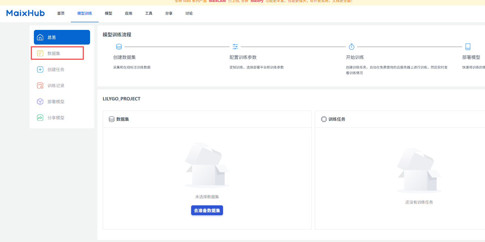
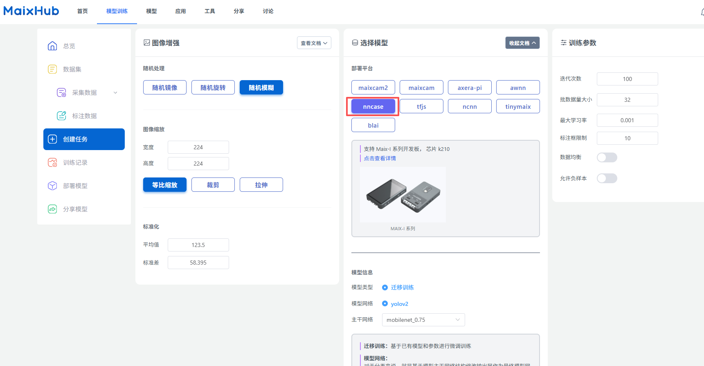

    <a target="_blank" style="margin: 1em;color: white; font-size: 0.9em; border-radius: 0.3em; padding: 0.5em 2em; background-color:rgb(103, 175, 8)" href="https://lilygo.cc/products/t-bao">Official Store</a>

## Version History:
| Version | Update date | Update description |
| :-----: | :---------: | :---------------- |
| T-Bao_V1.0 | Latest Version | Initial version of dual-core AIoT terminal based on K210+ESP32 |

## Purchase Links

| Product | AI Chip | Main MCU | Screen | Camera | Link |
| :-----: | :--: | :---: | :---: | :--: | :--: |
| T-Bao | K210 | ESP32-S3 | 1.54" IPS Touch | OV2640 | [LILYGO Mall](https://lilygo.cc/products/t-bao) |

## Table of Contents
- [Description](#description)
- [Preview](#preview)
- [Modules](#modules)
- [Quick Start](#quick-start)
- [Pin Overview](#pin-overview)
- [Related Tests](#related-tests)
- [FAQ](#faq)
- [Projects](#projects)
- [Resources](#resources)
- [Dependent Libraries](#dependent-libraries)

## Description

T-Bao is an open-source AIoT terminal based on ESP32-S3-WROOM-1 and K210 RISC-V AI chip, featuring high performance, low power consumption, expandability, and programmability. It deeply integrates K210 RISC-V architecture AI chip with ESP32 dual-core Wi-Fi/BLE communication module, equipped with professional-grade OV2640 2-megapixel camera (supporting 180° rotation adjustment) and ST7789V 1.54-inch IPS touch screen (90° adaptive rotation display), achieving millisecond-level face recognition and dynamic image processing.

Built-in MAX98357A I2S digital power amplifier, MSM261S high-sensitivity microphone array and hardware codec unit, supporting voice interaction and high-definition audio output. Uses AXP202 intelligent power management system, supports 3.7V lithium battery power supply and ultra-low power operation, integrates MPU6050 six-axis sensor, TF card storage expansion and rich interface resources (UART/SPI/I2C/Touch), fully compatible with Arduino/MicroPython ecosystem. Suitable for industrial vision detection, smart security, AIoT terminals and educational robots.

## Preview

### Physical Image

### Pin Diagram

### Important Notes

> ⚠️ **SD Card Usage Notes**

## Modules

### AI Processor (K210)

* Chip: Kendryte K210
* Architecture: RISC-V Dual Core 64bit with FPU
* Frequency: 400MHz (can be overclocked to 600MHz)
* Memory: 8MB SRAM
* NPU: KPU Neural Network Processor
* Features: Supports YOLOv3, Mobilenetv2, TinyYOLOv2, face recognition and other models

### Main Controller

* Chip: ESP32-D0WDQ6-V3
* Core: Xtensa LX6 Dual Core
* FLASH: 16MB
* PSRAM: 8MB
* Clock: 240MHz
* Wireless: Wi-Fi 802.11 b/g/n, Bluetooth 4.2 + BLE

### Display

* Size: 1.54-inch IPS
* Resolution: 240x240px
* Display Type: IPS LCD
* Driver Chip: ST7789V
* Touch: Capacitive Touch Screen
* UI Framework: LVGL

### Camera

* Sensor: OV2640
* Pixels: 2 megapixels
* Features: Supports 180° rotation adjustment

### Audio

* Amplifier: MAX98357A I2S
* Microphone: MSM261S High Sensitivity Microphone Array

### Sensors

* Motion Sensor: MPU6050 (Six-axis gyroscope + accelerometer)
* Power Management: AXP202 PMU

### Motor Driver

* Chip: DRV8833

### Overview

| Component | Description |
| :--: | :--: |
| AI Chip | K210 RISC-V Dual Core |
| Main MCU | ESP32-D0WDQ6-V3 |
| FLASH | 16MB |
| PSRAM | 8MB |
| Display | 1.54-inch ST7789 IPS Touch (240×240) |
| Camera | OV2640 (2 megapixels) |
| Audio | MAX98357A + MSM261S Microphone Array |
| Sensor | MPU6050 Six-axis Sensor |
| Power Management | AXP202 PMU |
| Motor Driver | DRV8833 |
| Storage | TF Card |
| Wireless | Wi-Fi 802.11b/g/n + Bluetooth 4.2 BLE |
| USB | 1 × TYPE-C Interface |
| Buttons | RST + BOOT + Knob + 4× Screen Buttons |
| Expansion Interface | 2 × QWIIC + 4 × Magnetic Interface |
| Dimensions | **164×46×42mm** |

## Quick Start

### Example Applications

| Application Type | K210 Firmware | ESP32 Firmware | Model File |
| :------ | :------: | :-------: | :------- |
| Direction Recognition | maixpy_twatch_v0.6.2-75-g973361c0d-dirty.bin | ESP32_AT_Firmware_UART1_SGPIO.bin | Identify_Direction_model.kmodel |
| Face Recognition | maixpy_twatch_v0.6.2-75-g973361c0d-dirty.bin | ESP32_AT_Firmware_UART1_SGPIO.bin | face_model_at_0x300000.kfpkg |
| Speech Recognition | maixpy_v0.6.2_83_gf0280db50_minimum_speech_with_ide_support.bin | ESP32_AT_Firmware_UART1_SGPIO.bin | maix_asr_2900k_0x500000.kmodel |

### K210 Firmware Flashing

1. Download the latest firmware: [MaixPy Firmware](https://cn.dl.sipeed.com/MAIX/MaixPy/release/master)
2. Download flashing tool: [kflash_gui](https://cn.dl.sipeed.com/shareURL/MAIX/tools)
3. Select corresponding firmware and model files for flashing

> **Note**: Speech recognition application requires writing the model file `maix_asr_2900k_0x500000.kmodel` to address 0x500000 first, then flashing the firmware.

### Model Training

Use [Maixhub](https://maixhub.com/) to train your own models.

[Maixhub](https://maixhub.com/) provides model training and model sharing functions. You only need to prepare the dataset for training, without setting up training environment and code. Upload training data to quickly train models, making it convenient to quickly create your AI applications, or to learn the process and principles of AI training.

Additionally, you can download your favorite models from the MaixHub model library, and even upload and share models you created yourself, whether they are trained on MaixHub or various interesting models trained with your own code!

#### Access Maixhub

1. After registering and logging into your account, go to the official website and click on Model Training

2. Click Create New Model, and enter the name and select the model type

3. Select dataset, click Upload Dataset

Here you can choose your own dataset, or select a dataset already prepared by Maixhub, or upload your own dataset.
 

> **Note**: When uploading datasets, please ensure the dataset format is .zip file, and after decompression, the dataset contains a folder named `dataset`, which contains the training dataset.

4. Select training parameters, click Start Training

> **Note**: The selection of training parameters needs to be adjusted according to your own requirements, such as training epochs, learning rate, optimizer, etc.
> !! The deployment platform currently supported by our examples for K210 platform is nncase, and the trained model file suffix is .kmodel.
 

5. Wait for training to complete, download model file

6. After downloading, upload the model file to the T-Bao device, and upload the `main.py` and `.kmodel` files from the compressed package to the SD card

> You can use [MaixPy IDE](https://dl.sipeed.com/shareURL/MAIX/MaixPy/ide) for simulation running, or use MicroPython for running.

### Development Platforms
1. [Arduino IDE](https://www.arduino.cc/en/software) - ESP32 Development
2. [MaixPy IDE](https://dl.sipeed.com/shareURL/MAIX/MaixPy/ide) - K210 Development
3. [ESP-IDF](https://www.espressif.com/en/products/sdks/esp-idf) - ESP32 Advanced Development
4. [MicroPython](https://docs.micropython.org/en/latest/) - Script Development

## Related Tests

*Test data to be completed*

## FAQ

* **Q. How do K210 and ESP32 communicate?**  
  A. Communication is through UART serial port, with K210 as AI processor and ESP32 as main controller and communication module.

* **Q. Camera not working properly?**  
  A. Check camera ribbon cable connection, ensure camera module is properly inserted, check power supply.

* **Q. Speech recognition inaccurate?**  
  A. Ensure use in quiet environment, check if microphone is blocked, try retraining the model.

* **Q. How to extend battery life?**  
  A. Use AXP202 power management functions, turn off camera and screen when not needed, enable low power mode.

* **Q. SD card not recognized?**  
  A. Refer to SD card installation diagram in Important Notes, ensure card is properly inserted and formatted as FAT32.

## Projects

* [T-Bao Schematic](https://github.com/Xinyuan-LilyGO/LilyGo-K210-Script/blob/master/schematic/K210_Main.pdf)
* [Example Code](https://github.com/Xinyuan-LilyGO/LilyGo-K210-Script)

## Resources

* [Schematic](https://github.com/Xinyuan-LilyGO/LilyGo-K210-Script/blob/master/schematic/K210_Main.pdf)
* [K210 Datasheet](https://canaan.io/product/kendryteai)
* [ESP32-S3 Datasheet](https://www.espressif.com/sites/default/files/documentation/esp32-s3_datasheet_en.pdf)
* [OV2640 Datasheet](https://www.ovt.com/sensors/OV2640)
* [ST7789 Datasheet](https://www.newhavendisplay.com/app_notes/ST7789V.pdf)
* [MicroPython Documentation](https://docs.micropython.org/en/latest/)

## Dependent Libraries

* [MaixPy](https://github.com/sipeed/MaixPy) - K210 Development Framework
* [LVGL](https://lvgl.io/) - Embedded Graphics Library
* [Arduino_GFX](https://github.com/moononournation/Arduino_GFX) - Graphics Display Library
* [ESP32 Arduino Core](https://github.com/espressif/arduino-esp32) - ESP32 Arduino Support
* [Adafruit_Sensor](https://github.com/adafruit/Adafruit_Sensor) - Sensor Library