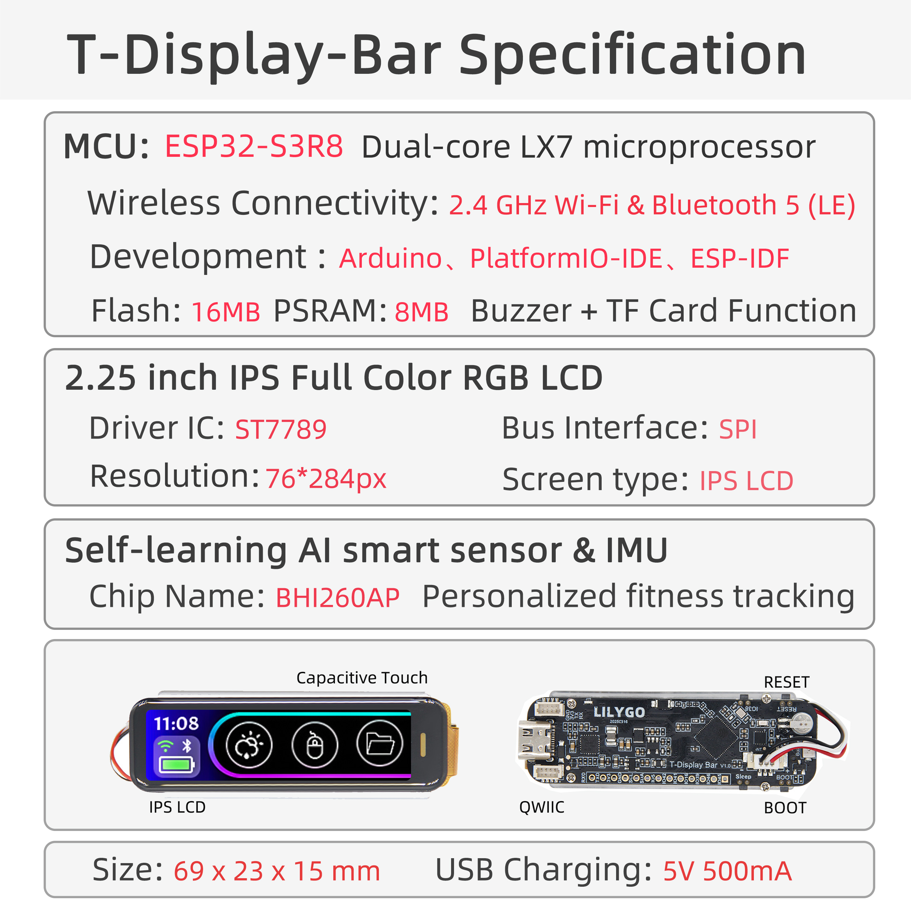

    <a target="_blank" style="margin: 1em;color: white; font-size: 0.9em; border-radius: 0.3em; padding: 0.5em 2em; background-color:rgb(63, 201, 28)" href="https://lilygo.cc/products/t-display-bar">Official Store</a>

## Version History:
| Version | Update Date | Update Description |
| :-----: | :---------: | :---------------- |
|  |  |  |

## Purchase Link

| Product | SOC | FLASH | PSRAM | Link |
| :-----: | :--: | :---: | :---: | :--: |
| T-Display Bar | ESP32-S3R8 | 16MB | 8MB (OPI PSRAM) | [LILYGO Mall](https://lilygo.cc/products/t-display-bar) |

## Table of Contents
- [Description](#description)
- [Preview](#preview)
- [Modules](#modules)
- [Quick Start](#quick-start)
- [Pin Overview](#pin-overview)
- [Related Tests](#related-tests)
- [FAQ](#faq)
- [Projects](#projects)
- [Resources](#resources)
- [Dependent Libraries](#dependent-libraries)

## Description

LILYGO T-Display Bar is a highly integrated embedded smart display module, featuring the ESP32-S3 high-performance chip at its core, combining multi-functional sensors with high-precision display technology. Its core configuration is as follows:

**Display System**
* Equipped with a 2.25-inch IPS full-color LCD screen, using ST7789 driver IC, with a resolution of 76×284 pixels (RGB arrangement).
* Supports capacitive touch (independent Touch_IRQ/Touch_RST control), providing a smooth human-machine interaction experience.
* Connected via SPI bus (CS/DC/RST/BL/MOSI/SCLK pins), optimizing display control efficiency.

**Intelligent Sensing Capability**
* Integrated BH1260AP AI sensor, supporting six-axis IMU (accelerometer + gyroscope) and personalized motion tracking.
* Equipped with I²C interface (SDA/SCL) and dedicated control pins (EN/RST/IRQ), enabling low-power environmental sensing and real-time data interaction.

**Expandability and Interfaces**
* Provides QWIIC ecosystem interface (compatible with I²C devices), supporting rapid expansion of sensor modules.
* Integrated TF card storage (SPI interface: MOSI/MISO/SCK/CS) and buzzer driver (BUZZer_IO).
* Uses USB Type-C interface, supporting 5V/500mA power supply and integrated program burning design.

**Physical Characteristics**
* Compact structural design (69×23×15mm), suitable for both industrial deployment and portable device requirements.
* Highly optimized pin layout (such as TFT CS/DC multiplexed with ESP32-GPIO), simplifying secondary development processes.

## Preview

### Physical Images

### Pinout Diagram

## Modules

### MCU

* Chip: ESP32-S3-R8
* PSRAM: 8M (OPI PSRAM)
* FLASH: 16M
* Other Notes: For more information, please visit [Espressif Official ESP32-S3 Datasheet](https://www.espressif.com.cn/sites/default/files/documentation/esp32-s3_datasheet_en.pdf)

### Screen

* Size: 2.25-inch IPS LCD
* Resolution: 76x284px
* Type: IPS LCD
* Driver IC: ST7789
* Compatible Libraries: TFT_eSPI
* Bus Protocol: SPI

### Touch

* Chip: CST816
* Bus Protocol: I2C

### Sensor

* Chip: BHI260AP
* Functions: Supports six-axis IMU (accelerometer + gyroscope), AI sensor
* Bus Protocol: I2C

### Overview

| Component | Description |
| :--: | :--: |
| MCU | ESP32-S3R8 Dual-core LX7 microprocessor |
| FLASH| 16MB |
| PSRAM | 8MB|
| Screen | 2.25 inch ST7789 IPS LCD (76*284px)|
| Touch | CST816 Capacitive Touch Screen |
| Sensor | BHI260AP AI sensor, supports six-axis IMU |
| Storage | TF Card |
| Buzzer | Active buzzer |
| Wireless | 2.4 GHz Wi-Fi & Bluetooth 5 (LE) |
| USB | 1 × USB Port and OTG (TYPE-C Interface) |
| IO Interface | 2.54mm pitch 13pin interface |
| Expansion Interfaces | 2 × QWIIC interfaces + 1 x battery connector |
| Buttons | 1 x RESET button + 1 x BOOT button + 1 x IO38 button + 1 x Sleep button |
| Dimensions | **69x23x15mm** |

## Quick Start

### Example Support

| Example | Description |
| :------ | :---------- |
| Factory | Factory test example, includes desktop weather and Bluetooth mouse |
| TFT_ESPI_Example | TFT_espi library adaptation |
| LVGL_Example | lvgl library adaptation |
| WIFI_Config | WiFi configuration example |
| BHI260AP | 6-axis IMU sensor example |
| BHI260AP_StepCounter | Walking step counter example |
| BQ27220 | Battery level monitor meter |
| BQ25896 | Power control chip routines |
| RTC | PCF8563 Real-Time Clock example |
| SD Card | SD card example |
| Colour_Test | TFT display color test |
| Colour_Test2 | TFT display color test |
| TouchDrv_CSTxxx_GetPoint | Display touch example |
| Sleep_Mode | ESP32S3 sleep mode example |

### PlatformIO
1. Install [Visual Studio Code](https://code.visualstudio.com/Download) according to your system.
2. Open the "Extensions" sidebar in Visual Studio Code (or press <kbd>Ctrl</kbd>+<kbd>Shift</kbd>+<kbd>X</kbd>), search for the "PlatformIO IDE" extension and install it.
3. While the extension is installing, download the project from GitHub. You can click the green "<> Code" button to download the main branch, or download a "Releases" version from the sidebar.
4. After the extension installation is complete, open the Explorer sidebar (or press <kbd>Ctrl</kbd>+<kbd>Shift</kbd>+<kbd>E</kbd>), click "Open Folder", find the project code you just downloaded (the entire folder), click "Add", and the project files will be added to your workspace.
5. Open the "platformio.ini" file in the project folder (PlatformIO should automatically open it after adding the folder). Under the "[platformio]" section, uncomment the line selecting the example program you want to upload (starting with "default_envs = xxx"). Then click the "<kbd>√</kbd>" at the bottom left to compile. If the compilation is successful, connect the board to your computer and click the "<kbd>→</kbd>" at the bottom left to upload.

### Arduino
1. Install [Arduino IDE](https://www.arduino.cc/en/software) according to your system.
2. Open the "example" directory in the project folder, select the example project folder, and open the file ending with ".ino" to open the Arduino IDE project workspace.
3. Open the "Tools" menu -> "Board" -> "Boards Manager", find or search for "esp32", and install the board files by "Espressif Systems". Then return to the "Board" menu and select the board type under "ESP32 Arduino". The board type to choose is determined by the "board = xxx" header in the "[env]" section of the "platformio.ini" file. If the corresponding board is not available, you need to manually add the board from the "board" directory in the project folder.
4. Open the "[File]" -> "[Preferences]" menu, find the "[Sketchbook location]" field. Copy and paste all library files and folders from the "libraries" directory in the project folder into the "libraries" folder at this location.
5. Select the correct settings in the "Tools" menu as shown in the table below.

#### ESP32-S3

| Arduino IDE Setting | Value |
| :-----------------: | :---: |
| Board | **ESP32S3 Dev Module** |
| Port | Your port |
| USB CDC On Boot | Enable |
| CPU Frequency | 240MHZ(WiFi) |
| Core Debug Level | None |
| USB DFU On Boot | Disable |
| Erase All Flash Before Sketch Upload | Disable |
| Events Run On | Core1 |
| Flash Mode | QIO 80MHZ |
| Flash Size | **16MB(128Mb)** |
| Arduino Runs On | Core1 |
| USB Firmware MSC On Boot | Disable |
| Partition Scheme | **8M with spiffs(3M APP/1.5MB SPIFFS)** |
| PSRAM | **OPI PSRAM** |
| Upload Mode | **UART0/Hardware CDC** |
| Upload Speed | 921600 |
| USB Mode | **CDC and JTAG** |

6. Select the correct port.
7. Click the "<kbd>√</kbd>" in the top right corner to compile. If the compilation is successful, connect the board to your computer and click the "<kbd>→</kbd>" to upload.

### Development Platforms
1. [Micropython](https://micropython.org/)
2. [Arduino IDE](https://www.arduino.cc/en/software)
3. [Platform IO](https://platformio.org/)

## Pin Overview

| GPIO | SPI | I2C | TFT(SPI) | TOUCH(I2C) | BUZZER | BHI260AP(I2C) | BUTTON | SD(SPI) | USB | BQ27220 | FLASH128M | UART |
| :--: | :-: | :-: | :------: | :--------: | :----: | :-----------: | :----: | :-----: | :-: | :-----: | :-------: | :--: |
| IO2 |  | I2C_SDA |  |  |  |  |  |  |  |  |  |  |
| IO3 |  | I2C_SDA |  |  |  |  |  |  |  |  |  |  |
| IO12 | SPI_MOSI |  |  |  |  |  |  |  |  |  |  |  |
| IO13 | SPI_MISO |  |  |  |  |  |  |  |  |  |  |  |
| IO14 | SPI_SCK |  |  |  |  |  |  |  |  |  |  |  |
| IO6 |  |  | TFT_MOSI |  |  |  |  |  |  |  |  |  |
| IO7 |  |  | TFT_SCLK |  |  |  |  |  |  |  |  |  |
| IO8 |  |  | TFT_CS |  |  |  |  |  |  |  |  |  |
| IO5 |  |  | TFT_DC |  |  |  |  |  |  |  |  |  |
| IO40 |  |  | TFT_RST |  |  |  |  |  |  |  |  |  |
| IO15 |  |  | TFT_BL |  |  |  |  |  |  |  |  |  |
| IO18 |  |  |  |  |  | BHI260AP_IRQ |  |  |  |  |  |  |
| IO17 |  |  |  |  |  | BHI260AP_RST |  |  |  |  |  |  |
| IO16 |  |  |  |  |  | BHI260AP_EN |  |  |  |  |  |  |
| IO11 |  |  |  |  |  |  |  | SD_CS |  |  |  |  |
| IO9 |  |  |  |  | BUZZER_PIN |  |  |  |  |  |  |  |
| IO21 |  |  |  | TOUCH_IRQ |  |  |  |  |  |  |  |  |
| IO1 |  |  |  | TOUCH_RST |  |  |  |  |  |  |  |  |
| IO38 |  |  |  |  |  |  | Button1 |  |  |  |  |  |
| IO0 |  |  |  |  |  |  | Button2 |  |  |  |  |  |
| IO19 |  |  |  |  |  |  |  |  | USB_N |  |  |  |
| IO20 |  |  |  |  |  |  |  |  | USB_P |  |  |  |
| IO10 |  |  |  |  |  |  |  |  |  | GPOUT |  |  |
| IO27 |  |  |  |  |  |  |  |  |  |  | SPIHD |  |
| IO28 |  |  |  |  |  |  |  |  |  |  | SPIWP |  |
| IO29 |  |  |  |  |  |  |  |  |  |  | SPICS0 |  |
| IO30 |  |  |  |  |  |  |  |  |  |  | SPICLK |  |
| IO31 |  |  |  |  |  |  |  |  |  |  | SPIQ |  |
| IO32 |  |  |  |  |  |  |  |  |  |  | SPID |  |
| IO44 |  |  |  |  |  |  |  |  |  |  |  | U0RXD |
| IO43 |  |  |  |  |  |  |  |  |  |  |  | U0TXD |

## Related Tests

*(Test data to be added)*

## FAQ

* **Q. I still don't know how to set up the programming environment after reading the above tutorial. What should I do?**  
  A. If you still don't understand how to set up the environment after reading the above tutorial, you can refer to the [LilyGo-Document](https://github.com/Xinyuan-LilyGO/LilyGo-Document) documentation for setup instructions.

* **Q. Why does Arduino IDE prompt me to upgrade library files when I open it? Should I upgrade or not?**  
  A. Choose not to upgrade library files. Different versions of library files may not be compatible with each other, so upgrading is not recommended.

* **Q. Why is there no serial data output from the "Uart" interface on my board? Is it broken?**  
  A. Because the project file is configured by default to use the USB interface as Uart0 serial output for debugging, and the "Uart" interface is connected to Uart0, it won't output any data without configuration.  
  PlatformIO users: Open the project file "platformio.ini", change the option "-DARDUINO_USB_CDC_ON_BOOT=true" under "build_flags = xxx" to "-DARDUINO_USB_CDC_ON_BOOT=false" to use the external "Uart" interface normally.  
  Arduino users: Open the "Tools" menu, select USB CDC On Boot: "Disabled" to use the external "Uart" interface normally.

* **Q. Why does my board keep failing to upload programs?**  
  A. Please hold down the "BOOT" button and try uploading again.

## Projects
* [T-Display-Bar](https://github.com/Xinyuan-LilyGO/T-Display-Bar/blob/master/hardware/H764%20T-Display%20Bar_V1.1.pdf)

## Resources
* [ESP32-S3 Datasheet](https://www.espressif.com.cn/sites/default/files/documentation/esp32-s3_datasheet_en.pdf)
* [BHI260AP Datasheet]()

## Dependent Libraries
* [ESP32-BLE-Mouse](https://github.com/T-vK/ESP32-BLE-Mouse)
* [ArduinoJson](https://github.com/bblanchon/ArduinoJson)
* [lvgl](https://github.com/lvgl/lvgl)
* [MadgwickAHRS](https://github.com/arduino-libraries/MadgwickAHRS)
* [SensorsLib](https://github.com/lewisxhe/SensorsLib)
* [XPowersLib](https://github.com/lewisxhe/XPowersLib)
* [TFT_eSPI](https://github.com/Bodmer/TFT_eSPI)