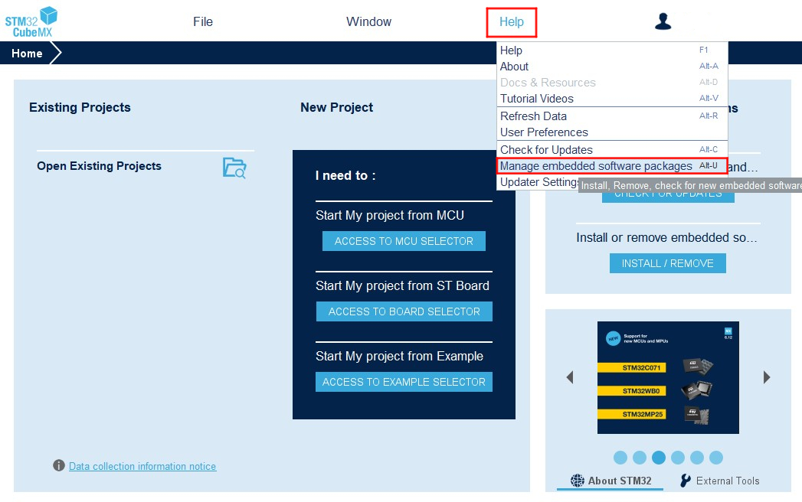

    <a target="_blank" style="margin: 1em;color: white; font-size: 0.9em; border-radius: 0.3em; padding: 0.5em 2em; background-color:rgb(63, 201, 28)" href="https://lilygo.cc/products/t-keyboard-s3-pro">Official Store</a>

> **Important Note**: A host device is required for use. Slave devices connect to the host via magnetic interfaces.

## Version History:
| Version | Update Date | Update Description |
| :-----------: | :-----------: | :-----------: |
| T-Keyboard-S3-Pro_MCU_V1.1 | 2024-09-05 | Original version |
| T-Keyboard-S3-Pro_Keyboard_V1.1| 2024-09-05 | Original version |
| T-Keyboard-S3-Pro_Magnet_Female_V1.0| 2024-09-05 | Original version |
| T-Keyboard-S3-Pro_Magnet_Male_V1.0| 2024-09-05 | Original version |
| T-Keyboard-S3-Pro_Keyboard_LCD_FPC_V1.0| 2024-09-05 | Original version |

## Purchase Links

| Product | Main SOC | Co-processor | FLASH | PSRAM | Link |
| :-----: | :--: | :---: | :---: | :---: | :--: |
| T-Keyboard S3 Pro | ESP32-S3 | STM32G030 | 16M | 8M (Octal SPI) | [LILYGO Mall](https://lilygo.cc/products/t-keyboard-s3-pro) |

## Table of Contents
- [Description](#description)
- [Preview](#preview)
- [Modules](#modules)
- [Quick Start](#quick-start)
- [FAQ](#faq)
- [Projects](#projects)

## Description

The T-Keyboard-S3 Pro is a high-end programmable keyboard based on a dual-MCU architecture (ESP32-S3 + STM32G030F6P6), designed specifically for developers and professional users. Its core features include 4 independent 0.85-inch RGB LCD screens (resolution 128x128), supporting multi-screen independent display of shortcuts, system status, or dynamic interactive interfaces; 4 hot-swappable mechanical keys compatible with custom switches, paired with RGB WS2812 lighting effects and a rotary encoder for programmable backlight modes and precise parameter adjustment (such as volume, scroll control). Hardware-wise, the main ESP32-S3 controller is equipped with 16MB Flash + 8MB PSRAM, supporting Wi-Fi/Bluetooth communication and complex logic operations, while the external STM32 chip assists in processing real-time input tasks to ensure low-latency response. In terms of expandability, it provides STEMMA QT/Qwlic interfaces and magnetic expansion capabilities, allowing connection of multiple slave devices to create a multi-functional control terminal.

## Preview

### Physical Image

### Pinout Diagram

## Modules

### Main MCU

* Module: ESP32-S3-WROOM-1
* Chip: ESP32-S3-R8
* PSRAM: 8M (Octal SPI)
* FLASH: 16M
* Related Resources:
    >[ESP32-S3-WROOM-1_datasheet](https://www.espressif.com/sites/default/files/documentation/esp32-s3-wroom-1_wroom-1u_datasheet_en.pdf)
* Dependent Libraries:
    >[Arduino_DriveBus-1.1.16]()

### Secondary MCU

* Chip: STM32G030F6P6
* SRAM: 8 Kbytes
* FLASH: 64 Kbytes
* Related Resources:
    >[STM32G030F6_datasheet](https://www.st.com/en/microcontrollers-microprocessors/stm32g030f6.html#documentation)

### Display

* Screen Model: N085-1212TBWIG06-C08
* Size: 0.85-inch
* Resolution: 128x128px
* Display Type: TFT
* Driver IC: GC9107
* Bus Communication Protocol: Standard SPI
* Other Notes: All screens share RST, DC, MOSI, SCLK, and BL pins on a common bus. All screens reset together during initialization reset. Control different screen data refresh by selecting different CS lines.
* Related Resources:
    >[GC9107_DataSheet_V1.2](./information/GC9107_DataSheet_V1.2.pdf)
* Dependent Libraries:
    >[TFT_eSPI-2.5.0](https://github.com/Bodmer/TFT_eSPI)  
    >[lvgl-8.3.5](https://github.com/lvgl/lvgl)   
    >[Arduino_GFX-1.3.7](https://github.com/moononournation/Arduino_GFX)  

### Hot-swappable Keys

* Specification: Uses Kailh hot-swap connectors with 6.35mm pin spacing. Compatible with any hot-swap key switches with 6.35mm pin spacing.
* PCB Connection: Pull-down enabled with low level as detection signal. Host KEY5 is multiplexed as BOOT-0 for system power-on mode selection, with a default 10K pull-up resistor. Also uses low level as detection signal. The pin must be configured with internal pull-up in software for stable use.
* Other Notes: Due to screen connections, be sure to select hot-swap keys with center openings. The spacing should be greater than 7mm to accommodate the ribbon cable width.

### Onboard LEDs

* Chip: WS2812C
* Related Resources:
    >[WS2812C-2020](./information/WS2812C-2020.pdf)

### Rotary Encoder

* Description: Four-pin copper thimble knob

### Overview

| Component | Description |
| :--: | :--: |
| Main Processor | ESP32-S3R8 Dual-core LX7 microprocessor |
| Co-processor | STM32G030F6P6 |
| Flash | 16MB (ESP32-S3) + 64KB (STM32) |
| PSRAM | 8MB (ESP32-S3) + 8KB (STM32) |
| Display | 4×0.85-inch GC9107 TFT LCD (128×128) |
| Keys | 4×Hot-swappable mechanical keys + Rotary encoder |
| RGB Lighting | WS2812C |
| GPS | MIA-M10Q |
| Storage | TF card |
| Wireless | Wi-Fi 802.11 b/g/n + BLE 5 |
| USB | 1 × Type-C Interface |
| Expansion Interface | 2×QWIIC + 4×Magnetic Interface |
| Buttons | RST + BOOT + 4×Screen buttons |
| UI Framework | LVGL |
| Dimensions | **164×46×42mm** |

## Quick Start

### Usage Notes

1. **I2C Communication Expansion**: Default firmware is configured for I2C communication expansion mode. When expanding slave devices, ensure each device has a unique I2C address to avoid address conflicts.
2. **Device Quantity Limit**: Maximum of 6 devices can be connected. When connecting multiple devices, reduce the maximum brightness of onboard LEDs to 10.
3. **Expansion Direction Limit**: Only one device can be expanded on each left and right side of the main board. Maximum of two devices can be expanded downward (USB interface may obstruct expansion). Maximum configuration is a 2×3 grid layout.

>Select the corresponding example program based on the version.

### ESP32S3 Host Device Software Guide

| Branch | `[PlatformIO (arduino-espressif32_v6.5.0)]` `[Arduino IDE (arduino-esp32-lib_v2.0.14)]`   Support |Description |
| :-----------: | :-----------: | :-----------: | 
|[arduino-esp32-libs_v2.0.14](https://github.com/Xinyuan-LilyGO/T-Keyboard-S3-Pro/tree/arduino-esp32-libs_V2.0.14)| 
  
 | ESP32S3 example programs written based on Arduino library version v2.0.14 |

#### Examples

| Example | Description | Picture |
| ------  | ------ | ------ | 
| [GFX](./examples/GFX) |  |  |
| [IIC_Scan_2](./examples/IIC_Scan_2) |  |  |
| [Keyboard](./examples/Keyboard) |  |  |
| [Original_Test](./examples/Original_Test) |  |  |
| [Original_Test_2](./examples/Original_Test_2) | Factory original test file |  |
| [Rotary_Encoder](./examples/Rotary_Encoder) |  |  |
| [T-Keyboard-S3-Pro_IIC_Command](./examples/T-Keyboard-S3-Pro_IIC_Command) |  |  |
| [T-Keyboard-S3-Pro_IIC_Scan](./examples/T-Keyboard-S3-Pro_IIC_Scan) |  |  |
| [Shortcut-Keys](./examples/Shortcut-Keys) |  |  |
| [Lvgl_UI](./examples/Lvgl_UI) | Factory original test file |  |

| Firmware | Description | Picture |
| ------  | ------  | ------ |
| [Original_Test_2](./firmware/[ESP32S3][T-Keyboard-S3-Pro_V1.0][Original_Test_2]_firmware_V1.0.0.bin) | Host device factory original test file |  |
| [Lvgl_UI](./firmware/[ESP32S3][T-Keyboard-S3-Pro_V1.0][Lvgl_UI]_firmware_V1.0.0.bin) | Host device factory original test file |  |

#### PlatformIO
1. Install [VisualStudioCode](https://code.visualstudio.com/Download), choose the version for your system.

2. Open the "Extensions" in the sidebar of Visual Studio Code (or use <kbd>Ctrl</kbd>+<kbd>Shift</kbd>+<kbd>X</kbd>), search for the "PlatformIO IDE" extension and install it.

3. While the extension is installing, you can go to GitHub to download the program. You can download the main branch code by clicking the green "<> Code" button, or download the "Releases" version from the sidebar.

4. After the extension is installed, open the sidebar's Explorer (or use <kbd>Ctrl</kbd>+<kbd>Shift</kbd>+<kbd>E</kbd>), click "Open Folder", find the project code you just downloaded (the entire folder), click "Add", and the project files will be added to your workspace.

5. Open the "platformio.ini" file in the project folder (PlatformIO will automatically open the "platformio.ini" of the corresponding folder after adding it). Under the "[platformio]" section, uncomment to select the example program you want to upload (marked by "default_envs = xxx"). Then click the "<kbd>[√](image/4.png)</kbd>" at the bottom left to compile. If the compilation is successful, connect the microcontroller to your computer and click "<kbd>[→](image/5.png)</kbd>" at the bottom left to upload.

#### Arduino
1. Install [Arduino IDE](https://www.arduino.cc/en/software), choose the version for your system.

2. Open the "example" directory in the project folder, select the example project folder, and open the file ending with ".ino" to open the Arduino IDE project workspace.

3. Open the top menu bar -> Select "Board" -> "Boards Manager", find or search for "esp32", and install the board files by "Espressif Systems". Then return to the "Board" menu and select the board type under "ESP32 Arduino". The board type to select is determined by the "board = xxx" header under the [env] section in the "platformio.ini" file. If the corresponding board is not available, you need to manually add the board from the "board" directory in the project folder.

4. Open the menu bar "[File]" -> "[Preferences]", find the "[Sketchbook location]" field, and copy all the library files along with their folders from the "libraries" folder in the project directory to the "libraries" folder in this location.

5. Select the correct settings in the "Tools" menu as shown in the table below.

##### ESP32-S3
| Setting | Value |
| :-------------------------------: | :-------------------------------: |
| Board | ESP32S3 Dev Module |
| Upload Speed | 921600 |
| USB Mode | Hardware CDC and JTAG |
| USB CDC On Boot | Enabled |
| USB Firmware MSC On Boot | Disabled |
| USB DFU On Boot | Disabled |
| CPU Frequency | 240MHz (WiFi) |
| Flash Mode | QIO 80MHz |
| Flash Size | 16MB (128Mb) |
| Core Debug Level | None |
| Partition Scheme | Default (6.25MB APP/3.43MB SPIFFS) |
| PSRAM | OPI PSRAM |
| Arduino Runs On | Core 1 |
| Events Run On | Core 1 |        

6. Select the correct port.

7. Click the "<kbd>[√]</kbd>" in the top right corner to compile. If the compilation is successful, connect the microcontroller to your computer and click "<kbd>[→]</kbd>" in the top right corner to upload.

#### Pin Overview

| IIC_1 Pins | ESP32S3 Pins |
| :------------------: | :------------------:|
| SDA | IO42 |
| SCL | IO2 |

| IIC_2 Pins (External) | ESP32S3 Pins |
| :------------------: | :------------------:|
| SDA | IO6 |
| SCL | IO7 |

| LCD Screen Pins | ESP32S3 Pins |
| :------------------: | :------------------:|
| MOSI | IO40 |
| SCLK | IO41 |
| DC | IO39 |
| RST | IO38 |
| BL | IO1 |

| Rotary Encoder Pins | ESP32S3 Pins |
| :------------------: | :------------------:|
| KNOB_DATA_A | IO4 |
| KNOB_DATA_B | IO5 |
| KNOB_DATA_KEY | IO0 |

### STM32 Slave Device Software Guide

| Branch | `[STM32CubeMX (stm32cubeg0-firmware-package_v1.6.2)]` `[ARM Keil μVision5 (Keil.STM32G0xx_DFP.1.4.0.pack)]`   Support |Description |
| :-----------: | :-----------: | :-----------: | 
|[stm32cubeg0-firmware-package_v1.6.2](https://github.com/Xinyuan-LilyGO/T-Keyboard-S3-Pro/tree/stm32cubeg0-firmware-package_V1.6.2)| 
  
 | STM32 example programs written based on stm32cubeg library version v1.6.2 and chip library version v1.4.0 |

#### Example Support

| Example | Description | Picture |
| ------  | ------ | ------ | 
| [KEY](https://github.com/Xinyuan-LilyGO/T-Keyboard-S3-Pro/edit/stm32cubeg0-firmware-package_V1.6.2/examples/KEY) |  |  |
| [Original_Test](https://github.com/Xinyuan-LilyGO/T-Keyboard-S3-Pro/edit/stm32cubeg0-firmware-package_V1.6.2/examples/Original_Test) | Factory original test file |  |
| [T-Keyboard-S3-Pro_IIC_Command](https://github.com/Xinyuan-LilyGO/T-Keyboard-S3-Pro/edit/stm32cubeg0-firmware-package_V1.6.2/examples/T-Keyboard-S3-Pro_IIC_Command) |  |  |
| [WS2812B](https://github.com/Xinyuan-LilyGO/T-Keyboard-S3-Pro/edit/stm32cubeg0-firmware-package_V1.6.2/examples/WS2812B) |  |  |

| Firmware | Description | Picture |
| ------  | ------  | ------ |
| [Slave_0x01_Original_Test_V1.0.0](https://github.com/Xinyuan-LilyGO/T-Keyboard-S3-Pro/edit/stm32cubeg0-firmware-package_V1.6.2/firmware/（修复LED的HUE值设置失败问题）[STM32G030F6P6_Drive_0x01][T-Keyboard-S3-Pro_V1.0][Original_Test]_firmware_V2_202501231722.hex) | Factory original test file for slave device 0x01 |  |
| [Slave_0x02_Original_Test_V1.0.0](https://github.com/Xinyuan-LilyGO/T-Keyboard-S3-Pro/edit/stm32cubeg0-firmware-package_V1.6.2/firmware/（修复LED的HUE值设置失败问题）[STM32G030F6P6_Drive_0x02][T-Keyboard-S3-Pro_V1.0][Original_Test]_firmware_V2_202501231722.hex) | Factory original test file for slave device 0x02 |  |
| [Slave_0x03_Original_Test_V1.0.0](https://github.com/Xinyuan-LilyGO/T-Keyboard-S3-Pro/edit/stm32cubeg0-firmware-package_V1.6.2/firmware/（修复LED的HUE值设置失败问题）[STM32G030F6P6_Drive_0x03][T-Keyboard-S3-Pro_V1.0][Original_Test]_firmware_V2_202501231722.hex) | Factory original test file for slave device 0x03 |  |
| [Slave_0x04_Original_Test_V1.0.0](https://github.com/Xinyuan-LilyGO/T-Keyboard-S3-Pro/edit/stm32cubeg0-firmware-package_V1.6.2/firmware/（修复LED的HUE值设置失败问题）[STM32G030F6P6_Drive_0x04][T-Keyboard-S3-Pro_V1.0][Original_Test]_firmware_V2_202501231722.hex) | Factory original test file for slave device 0x04 |  |
| [Slave_0x05_Original_Test_V1.0.0](https://github.com/Xinyuan-LilyGO/T-Keyboard-S3-Pro/edit/stm32cubeg0-firmware-package_V1.6.2/firmware/（修复LED的HUE值设置失败问题）[STM32G030F6P6_Drive_0x05][T-Keyboard-S3-Pro_V1.0][Original_Test]_firmware_V2_202501231722.hex) | Factory original test file for slave device 0x05 |  |
| [Slave_0x06_Original_Test_V1.0.0](https://github.com/Xinyuan-LilyGO/T-Keyboard-S3-Pro/edit/stm32cubeg0-firmware-package_V1.6.2/firmware/（修复LED的HUE值设置失败问题）[STM32G030F6P6_Drive_0x06][T-Keyboard-S3-Pro_V1.0][Original_Test]_firmware_V2_202501231722.hex) | Factory original test file for slave device 0x06 |  |

#### STM32CubeMX
1. Install [JAVA](https://www.java.com/en/download/), required before installing STM32CubeMX.

2. Install [STM32CubeMX](https://www.st.com/en/development-tools/stm32cubemx.html), choose the version for your system.

3. Open STM32CubeMX, find "Help->Manage embedded software packages" in the menu bar to open the software package manager. Select the "STM32G0" software package and download/install the corresponding version.

4. After completing the above preparations, you can use STM32CubeMX to configure your project. The example code includes pre-configured STM32CubeMX project files. Open the file with the ".ioc" extension in the example folder.

#### ARM Keil μVision5
1. Install [ARM Keil μVision5](https://www.keil.arm.com/mdk-community/), choose the version for your system.

2. Open Keil, find the "Pack Installer" in the menu bar

to open the software package manager. In the package manager page, search for "STM32G0" and install the 1.4.0 version of the software library.

3. Install the appropriate debugger driver. Supported debugger types can be found in the "Debug" tab of "Options for Target" in the Keil menu bar. Additionally, set up the "programming algorithm" as shown below.

    

The debug port for the STM32G0 on the board is located on the back of the "T-Keyboard-S3-Pro_Keyboard" board as shown below:

    

4. Open any example with the ".uvprojx" extension in the example directory, click "Rebuild" in the menu bar to build, connect the debugger to the device, and click "Download" to program.

#### STM32CubeProgrammer
1. Install [STM32CubeProgrammer](https://www.st.com/en/development-tools/stm32cubeprog.html), choose the version for your system.

2. Open STM32CubeProgrammer, select the correct debugger. Using STLINK as an example, configure as shown in the red box below, select the firmware file to download, and click "Start Programming" to begin downloading. UART download follows the same principle.

    

The UART debug port on the board is located on the back of the "T-Keyboard-S3-Pro_Keyboard" board as shown below:

    

#### Pin Overview

| IIC Pins | STM32G0 Pins |
| :------------------: | :------------------:|
| SDA | PC14/PB9 |
| SCL | PB7/PB8 |

| KEY Pins | STM32G0 Pins |
| :------------------: | :------------------:|
| KEY1 | PA1 |
| KEY2 | PA0 |
| KEY3 | PC15 |
| KEY4 | PB3/PB4/PB5/PB6 |
| KEY5 | PA12[PA10] |

| LCD Screen Pins | STM32G0 Pins |
| :------------------: | :------------------:|
| LCD_CS1 | PA4 |
| LCD_CS2 | PA11[PA9] |
| LCD_CS3 | PB0/PB1/PB2/PA8 |
| LCD_CS4 | PA6 |
| LCD_CS5 | PA5 |

| LED Pins | STM32G0 Pins |
| :------------------: | :------------------:|
| WS2812B_DATA | PA7 |

## FAQ

*   **Q. What are the main features of the T-Keyboard S3 Pro?**
    A. This is a high-end programmable keyboard with 4 independent LCD screens, hot-swappable mechanical keys, RGB lighting, rotary encoder, and a powerful dual-MCU architecture, supporting multi-device magnetic expansion.

*   **Q. How to expand slave devices?**
    A. Connect slave devices via magnetic interfaces, supporting up to 6 devices in a 2×3 grid layout. Note that each slave must have a unique I2C address.

*   **Q. Which switch types are supported by the hot-swappable mechanical keys?**
    A. Supports standard hot-swappable mechanical switches, compatible with most MX-structure mechanical switches.

*   **Q. How does the multi-screen display work?**
    A. The 4 screens can independently display different content, such as system status, shortcuts, media controls, etc., driven via SPI interface.

*   **Q. What are the advantages of the dual-MCU architecture?**
    A. ESP32-S3 handles complex graphical interfaces and wireless communication, while STM32 is responsible for real-time input processing, ensuring low-latency key response.

*   **Q. What should be noted when expanding multiple devices?**
    A. When connecting multiple devices, reduce LED brightness to 10 and pay attention to expansion direction limitations (1 on each side, maximum 2 downward).

## Projects

* [SCH_T-Keyboard-S3-Pro_MCU_V1.1](https://github.com/Xinyuan-LilyGO/T-Keyboard-S3-Pro/blob/main/project/SCH_T-Keyboard-S3-Pro_MCU_V1.1.pdf)
* [SCH_T-Keyboard-S3-Pro_Keyboard_V1.1](https://github.com/Xinyuan-LilyGO/T-Keyboard-S3-Pro/blob/main/project/SCH_T-Keyboard-S3-Pro_Keyboard_V1.1.pdf)
* [SCH_T-Keyboard-S3-Pro_Magnet_Female_V1.0](https://github.com/Xinyuan-LilyGO/T-Keyboard-S3-Pro/blob/main/project/SCH_T-Keyboard-S3-Pro_Magnet_Female_V1.0.pdf)
* [SCH_T-Keyboard-S3-Pro_Magnet_Male_V1.0](https://github.com/Xinyuan-LilyGO/T-Keyboard-S3-Pro/blob/main/project/SCH_T-Keyboard-S3-Pro_Magnet_Male_V1.0.pdf)
* [SCH_T-Keyboard-S3-Pro_Keyboard_LCD_FPC_V1.0](https://github.com/Xinyuan-LilyGO/T-Keyboard-S3-Pro/blob/main/project/SCH_T-Keyboard-S3-Pro_Keyboard_LCD_FPC_V1.0.pdf)

## Resources

*   [ESP32-S3-WROOM-1 Datasheet](https://www.espressif.com/sites/default/files/documentation/esp32-s3-wroom-1_wroom-1u_datasheet_en.pdf)
*   [STM32G030F6P6 Datasheet](https://www.st.com/en/microcontrollers-microprocessors/stm32g030f6.html#documentation)
*   [GC9107 Datasheet](https://github.com/Xinyuan-LilyGO/T-Keyboard-S3-Pro/blob/main/information/GC9107_DataSheet_V1.2.pdf)
*   [WS2812C Datasheet](https://github.com/Xinyuan-LilyGO/T-Keyboard-S3-Pro/blob/main/information/WS2812C-2020.pdf)

## Dependent Libraries
*   [RadioLib](https://github.com/jgromes/RadioLib)
*   [TFT_eSPI](https://github.com/Bodmer/TFT_eSPI)
*   [LVGL](https://github.com/lvgl/lvgl/tree/v8.4.0)
*   [Arduino_GFX](https://github.com/moononournation/Arduino_GFX)