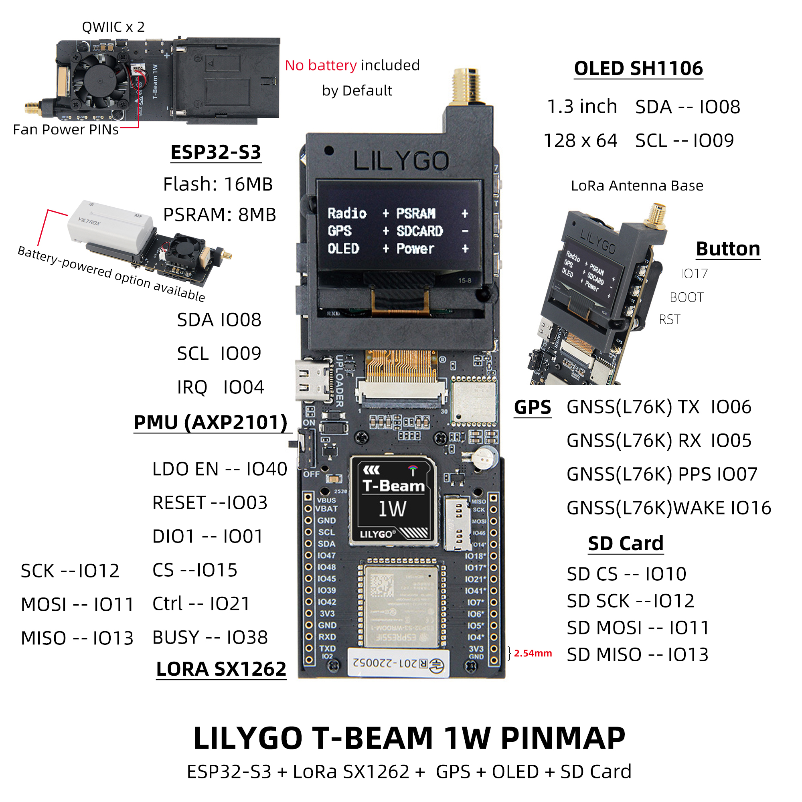

    <a target="_blank" style="margin: 1em;color: white; font-size: 0.9em; border-radius: 0.3em; padding: 0.5em 2em; background-color:rgb(63, 201, 28)" href="https://lilygo.cc/products/t-beam-1w">Official Store</a>

## Version History:
| Version | Update date | Update description |
| :-----: | :---------: | :---------------- |
| T-Beam-1W_V1.0 | 2024-06-15 | Initial Version |
| T-Beam-1W_V1.1 | 2024-08-22 | Optimized power circuit, added fan control |

## Purchase Links

| Product | SOC | FLASH | PSRAM | PMU | Link |
| :-----: | :--: | :---: | :---: | :--: | :--: |
| T-Beam-1W | ESP32-S3FN8 | 16MB | 8MB (OPI PSRAM) | AXP2101 | [LILYGO Mall](https://lilygo.cc/products/t-beam-1w) |

## Table of Contents
- [Overview](#overview)
- [Functional Block Diagram](#functional-block-diagram)
- [Specifications](#specifications)
- [Quick Start](#quick-start)
- [Pin Mapping](#pin-mapping)
- [Electrical Parameters](#electrical-parameters)
- [Buttons and LED Description](#buttons-and-led-description)
- [RF Parameters and Precautions](#rf-parameters-and-precautions)
- [FAQ](#faq)
- [Resource Downloads](#resource-downloads)

## Overview

T-Beam-1W is a high-performance IoT development board integrating **ESP32-S3** dual-core processor, **LoRa SX1262** module, **GPS L76K** positioning module, **SH1106 OLED screen**, and **AXP2101 power management chip**. Onboard TF card slot, QWIIC interface, external antenna interface, supporting Wi-Fi, Bluetooth 5.0 and LoRa communication, suitable for long-distance communication, positioning tracking, environmental monitoring, and other application scenarios.

> **Usage Notes:**
> 1. This board does not charge external 7.4V batteries, only powered by batteries.
> 2. Always connect the antenna before transmission to avoid damaging the RF module.
> 3. GPIOs marked with * in the pin table are already connected to internal modules and cannot be reused.
> 4. The maximum output power of the RF module on this board is 32dBm.

### Physical Image

## Specifications

| Component | Specification |
| :-- | :-- |
| MCU | ESP32-S3FN8, dual-core LX7, 240MHz |
| Wireless | Wi-Fi 2.4GHz + Bluetooth 5.0 LE |
| LoRa Module | SX1262, supports 830~945MHz |
| GPS Module | L76K, supports multi-constellation positioning |
| Display | 1.3-inch SH1106 OLED, 128×64 resolution |
| Storage | 16MB Flash + 8MB PSRAM, supports TF card expansion |
| Power Management | AXP2101, supports USB-C power supply, 7.4V battery input |
| Interfaces | QWIIC, UART, SPI, I2C, TF card slot |
| Buttons | BOOT, RESET, custom button |
| Dimensions | 133 × 43 × 27 mm |
| USB Power Supply | 5V / 500mA |

## Quick Start

### PlatformIO Environment Setup

1.  Install [Visual Studio Code](https://code.visualstudio.com/) and [Python](https://www.python.org/)
2.  Search for and install the `PlatformIO` plugin in `Visual Studio Code` extensions
3.  After installation is complete, you need to restart `Visual Studio Code`
4.  After restarting, select `File` -> `Open Folder` -> select the `LilyGo-LoRa-Series` directory
5.  Wait for third-party dependency libraries to install
6.  Click to open the `platformio.ini` file, under the `platformio` section
7.  Under `default_envs`, select the development board name you want to use and uncomment it
8.  Uncomment one line of `src_dir = xxxx` to ensure only one line is active. Please note the example comments, which explain which features are available and which are not.
9.  Click the (✔) symbol at the bottom left to compile
10. Connect the development board to the computer using a USB-C cable (Micro-USB interface is for module firmware upgrade)
11. Click (→) to upload firmware
12. Click (plug symbol) to monitor serial output
13. If unable to write or USB device keeps flashing, please check the **FAQ** below

### Arduino IDE Environment Setup

1. Install [Arduino IDE](https://www.arduino.cc/en/software)
2. Install [Arduino ESP32](https://docs.espressif.com/projects/arduino-esp32/en/latest/)
3. Copy all folders in the `lib` directory to the `Sketchbook location` directory. To find your own library location, refer to: [https://support.arduino.cc/hc/en-us/articles/4415103213714-Find-sketches-libraries-board-cores-and-other-files-on-your-computer](https://support.arduino.cc/hc/en-us/articles/4415103213714-Find-sketches-libraries-board-cores-and-other-files-on-your-computer)

* Windows: `C:\Users\{username}\Documents\Arduino`
* macOS: `/Users/{username}/Documents/Arduino`
* Linux: `/home/{username}/Arduino`

4. Open the corresponding example
* Open the downloaded `LilyGo-LoRa-Series`
* Open `examples`
* Select the example file and open the file ending with `ino`

5. Select the corresponding development board in the Arduino IDE Tools menu, and click the corresponding option in the list below to select.

| Name                                 | Value                               |
| :------------------------------------: | :-----------------------------------: |
| Board                                | **ESP32S3 Dev Module**              |
| Port                                 | Your port                           |
| USB CDC On Boot                      | Enable                              |
| CPU Frequency                        | 240MHZ(WiFi)                        |
| Core Debug Level                     | None                                |
| USB DFU On Boot                      | Disable                             |
| Erase All Flash Before Sketch Upload | Disable                             |
| Flash Mode                           | QIO 80Mhz                           |
| Flash Size                           | **16MB(128Mb)**                     |
| Arduino Runs On                      | Core1                               |
| USB Firmware MSC On Boot             | Disable                             |
| Partition Scheme                     | **16M Flash (3MB APP/9.9MB FATFS)** |
| PSRAM                                | **OPI PSRAM**                       |
| Upload Speed                         | 921600                              |
| Programmer                           | **Esptool**                         |

6. Please uncomment the `utilities.h` file of each sketch according to your board model (e.g., `T_BEAM_1W`), otherwise compilation will report an error
7. Upload the example

## Pin Mapping

| Pin Name | GPIO | Available |
| :--- | :---: | :---: |
| Uart1 TX | 43 | ✅ |
| Uart1 RX | 44 | ✅ |
| I2C SDA | 8 | ❌ |
| I2C SCL | 9 | ❌ |
| SPI MOSI | 11 | ❌ |
| SPI MISO | 12 | ❌ |
| SPI SCK | 13 | ❌ |
| SD CS | 10 | ❌ |
| GPS TX | 6 | ❌ |
| GPS RX | 5 | ❌ |
| GPS PPS | 7 | ❌ |
| GPS Wake-up | 16 | ❌ |
| LoRa RESET | 3 | ❌ |
| LoRa DIO1 | 1 | ❌ |
| LoRa CS | 15 | ❌ |
| LoRa LDO EN | 40 | ❌ |
| LoRa Ctrl | 21 | ❌ |
| LoRa BUSY | 38 | ❌ |
| BOOT Button | 0 | ❌ |
| Custom Button | 17 | ❌ |
| Onboard LED | 18 | ❌ |
| NTC ADC | 14 | ❌ |
| Battery ADC | 4 | ❌ |
| Fan Control | 41 | ❌ |

> **Note:**
> - LDO EN is the module internal enable pin, high level turns on Radio.
> - LoRa Ctrl is the internal LNA control pin, high level during reception, low level during transmission/sleep.

## Electrical Parameters

| Item | Description |
| :--- | :--- |
| USB-C Input Voltage | 3.9V ~ 6V |
| Charging Function | Not Supported |
| Battery Voltage | 7.4V |

> **Tip:** Recommended battery discharge capability ≥ 2A, otherwise high-power transmission may trigger protection.

## Buttons and LED Description

| Button | Function |
| :---: | :--- |
| IO17 | Custom Button |
| BOOT | Download Mode/Custom |
| RST | Reset |
| PWR (Power Button) | Long press 6 seconds to shut down |

| LED | Description |
| :---: | :---: |
| IO18 LED | Controlled by GPIO18 |
| PPS LED | Flashes with GPS pulse |
| USB LED | Lights up when USB is connected |

## Related Tests

| Band | Module Model | Frequency Range | Output Power | Modulation |
| :---: | :---: | :---: | :---: | :---: |
| 868MHz | SX1262 (XY16P35) | 830~950MHz | Max 32dBm | LoRa/FSK/GMSK |
| 433MHz | SX1262 (XY16P354) | 400~520MHz | Max 32dBm | LoRa/FSK/GMSK |

**Important Reminders:**
1. Always connect the antenna before transmission.
2. Recommended PA stabilization time > 800us.
3. Switch RF Switch to TX channel in advance before transmission, otherwise PA may be damaged.

### RF Block Diagram

### VCC=+5V, 400M~520MHz module output power dBm and current

### VCC=+5V, 830M~950MHz module output power dBm and current

## FAQ

* **Q. Why does the USB device keep flashing during flashing?**  
  A. Please check if the correct development board model is selected, and ensure the macro definition in `utilities.h` is enabled.

* **Q. Why is the LoRa transmission distance very short?**  
  A. Please confirm that the antenna is connected, RF Switch is correctly switched, and output power is set reasonably.

* **Q. Why does it not power on when using battery power?**  
  A. Please check if the battery voltage is around 7.4V and if the battery discharge capability is sufficient.

* **Q. GPS positioning slow or no signal?**  
  A. Please ensure use in an outdoor open environment and check antenna connection.

* RF Block Diagram

## Resource Downloads

* [Schematic PDF](https://github.com/Xinyuan-LilyGO/LilyGo-LoRa-Series/blob/13db0dd8bd4fdc8c080ef1337d56255529870630/schematic/T-Beam_1W_V1.0.pdf)
* [SX1262 Datasheet](https://www.semtech.com/products/wireless-rf/lora-transceivers/sx1262)
* [AXP2101 Datasheet](https://www.x-powers.com/en/product/axp2101)
* [Example Code Repository](https://github.com/Xinyuan-LilyGO/LilyGo-LoRa-Series)