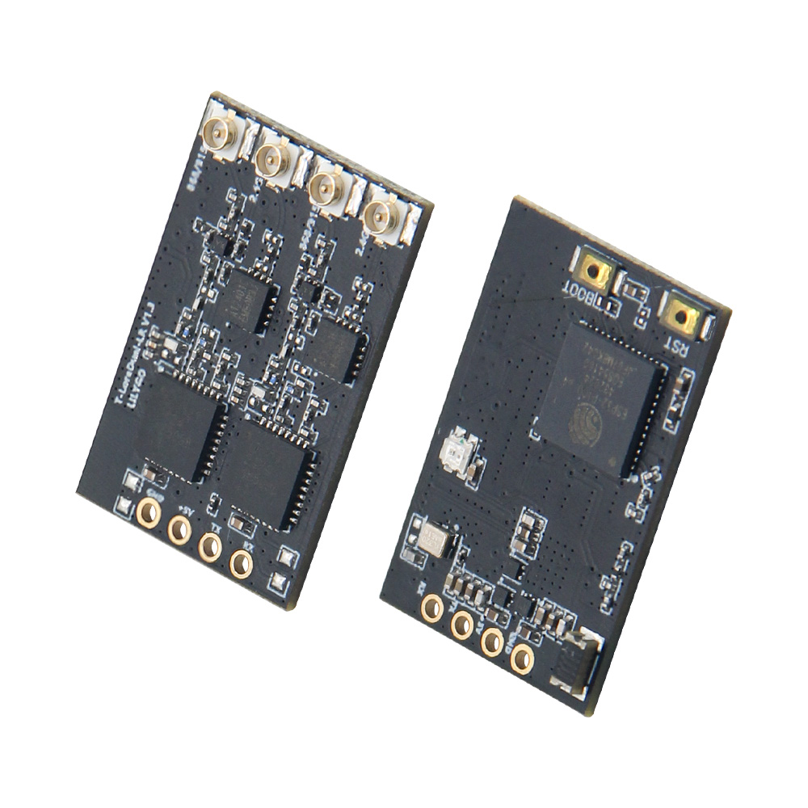
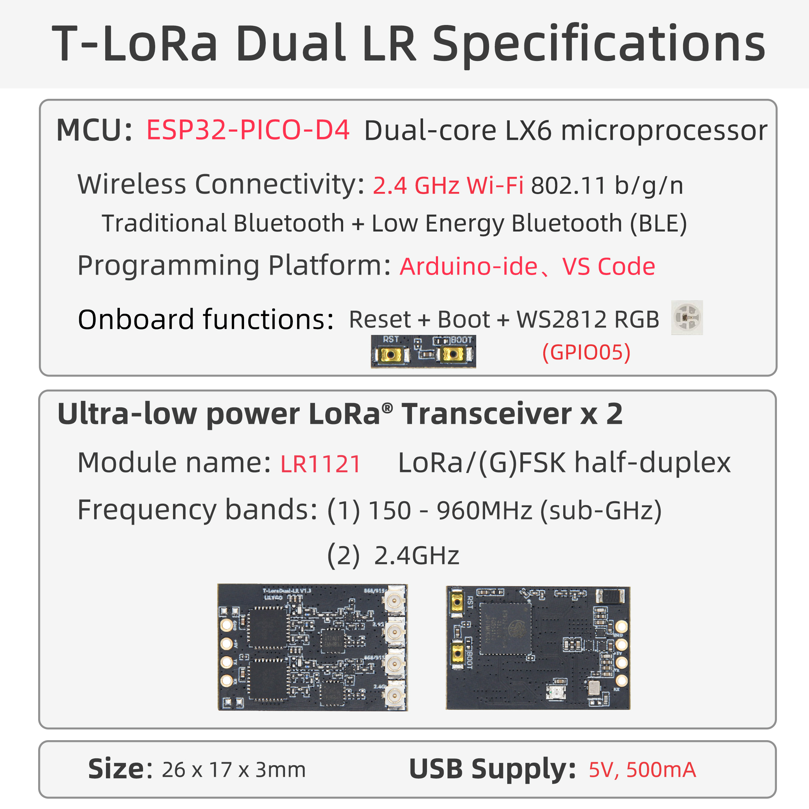

<div style="width:100%; display:flex;justify-content: center;">


</div>

<div style="padding: 1em 0 0 0; display: flex; justify-content: center">
    <a target="_blank" style="margin: 1em;color: white; font-size: 0.9em; border-radius: 0.3em; padding: 0.5em 2em; background-color:rgb(63, 201, 28)" href="https://lilygo.cc/products/t-lora-dual">Official Store</a>
</div>

## Version History:
| Version | Update date | Update description |
| :-----: | :---------: | :---------------- |
| T-ELRS_V1.0 | 2025-03-15 | Initial version, supports ExpressLRS protocol |
| T-ELRS_V1.1 | 2025-06-20 | Optimized SPI timing, increased stability |

## Purchase Links

| Product | MCU | Wireless Module | Band Support | Link |
| :-----: | :--: | :---: | :---: | :--: |
| T-ELRS | ESP32-PICO-D4 | LR1121 ×2 | Sub-GHz + 1.9GHz + 2.4GHz | [LILYGO Mall](https://lilygo.cc/products/t-lora-dual) |

## Table of Contents
- [Project Overview](#project-overview)
- [Hardware Configuration](#hardware-configuration)
- [Pin Assignment](#pin-assignment)
- [Function Description](#function-description)
- [File Directory](#file-directory)
- [Flashing Guide](#flashing-guide)
- [Compilation Guide](#compilation-guide)
- [FAQ](#faq)

## Project Overview

<div style="width:100%; display:flex;justify-content: center;">



</div>

T-Lora-Dual is a dual-band wireless communication module based on the **ESP32-PICO-D4** microcontroller, integrating two **LR1121** multi-band wireless chips, specifically designed for the **ExpressLRS** flight control protocol. This module supports Sub-GHz/1.9GHz/2.4GHz multi-band communication, suitable for scenarios such as remote control transmitter modules, drone data links, IoT long-distance communication, etc.

## Hardware Configuration



| Module | Model | Main Features |
| :--- | :--- | :--- |
| **Main MCU** | ESP32-PICO-D4 | Dual-core processor, 240MHz, supports Wi-Fi/Bluetooth, 34 GPIOs |
| **Wireless Module** | LR1121 ×2 | Sub-GHz + 1.9GHz/2.4GHz dual-band, supports LoRa®/FSK modulation |
| **Status Indicator** | LED | Controlled by GPIO5, used for working status indication |
| **RF Switch** | AT2401 | Controls antenna switching, supports dual-channel transmission/reception |

## Pin Assignment


### LR1121-1 Module
| Signal | ESP32 Pin | Description |
| :--- | :---: | :--- |
| MISO | 33 | SPI data input |
| MOSI | 32 | SPI data output |
| SCK | 25 | SPI clock |
| CS | 27 | Chip select |
| DIO9 | 37 | Interrupt signal |
| RST | 26 | Module reset |
| BUSY | 36 | Module status output |

### LR1121-2 Module
| Signal | ESP32 Pin | Description |
| :--- | :---: | :--- |
| MISO | 33 | SPI data input (shared) |
| MOSI | 32 | SPI data output (shared) |
| SCK | 25 | SPI clock (shared) |
| CS | 13 | Chip select |
| DIO9 | 34 | Interrupt signal |
| RST | 21 | Module reset |
| BUSY | 39 | Module status output |

### AT2401 RF Switch
| Signal | ESP32 Pin | Function |
| :--- | :---: | :--- |
| TX1 | 14 | Transmission channel 1 control |
| TX2 | 15 | Transmission channel 2 control |
| RX1 | 10 | Reception channel 1 control |
| RX2 | 9 | Reception channel 2 control |

### Status Indicator
| Signal | ESP32 Pin | Function |
| :--- | :---: | :--- |
| LED | 5 | Status indicator LED |

## Function Description

1. **Dual Module Architecture**: Two LR1121 modules share the SPI bus (SCK/MOSI/MISO), with independent CS signals enabling dual-band concurrent communication.
2. **Hardware Isolation**: Each module has independent RESET, BUSY, DIO9 pins, ensuring communication processes do not interfere with each other.
3. **Status Monitoring**: DIO9 is used for module interrupt reception, BUSY provides real-time module working status feedback.
4. **RF Switching**: AT2401 controls antenna switching, supports dual-channel transmission/reception mode switching.

## File Directory

```text
├── ExpressLRS/                 # ExpressLRS related code directory
│   └── src/                    # Source code directory
│       ├── user_defines        # ExpressLRS configuration
│       ├── hardware/           # Hardware directory
│       │   ├── RX/              # ExpressLRS receiver hardware IO corresponding files (T-ELRS LR1121 True Diversity.json)
│       │   ├── TX/              # ExpressLRS transmitter hardware IO corresponding files
│       │   └── targets.json     # ExpressLRS hardware IO compilation target selection file (compile selection 1.BAYCKRC 900/2400 Dual Band Gemini RX)
│       └── lib/                # ExpressLRS dependency libraries
├── T-ELRS/                     # T-ELRS related code directory
│   ├── src/                    # Source code directory
│   ├── examples/               # Example codes
│   ├── firmware/               # Firmware directory
│   └── hardware/               # Hardware schematic
└── README.md                   # English project description file
└── README_CN.md                # Chinese project description file
```
For deeper understanding, please visit the [ExpressLRS official website](https://www.expresslrs.org/quick-start/getting-started/)

## Flashing Guide

1. Ensure ESP32 enters download mode before flashing (hold down the BOOT button, then press and release the RESET button)
2. Use ESP Flash Download Tool (Windows)
3. Check if the serial port driver is properly installed
4. If flashing fails, try lowering the baud rate or changing the USB cable
5. Press the RESET button to restart the device after flashing is complete

## Compilation Guide

### ExpressLRS Compilation (PlatformIO Only)
1. Open the src subdirectory under the ExpressLRS directory with VSCode
2. First select the device model


3. Then click compile and upload. The first compilation requires downloading files, which may be a bit slow


### T-ELRS Compilation
#### PlatformIO
1. Open the T-ELRS directory with VSCode, then open the platformio file and uncomment the example to be compiled


2. Then click compile and upload


#### Arduino IDE
1. Move the lib directory under the T-ELRS directory to the Arduino project dependency library directory


2. Open the example in the examples directory with Arduino IDE
3. Select the chip model and choose the default configuration


4. Click compile and upload