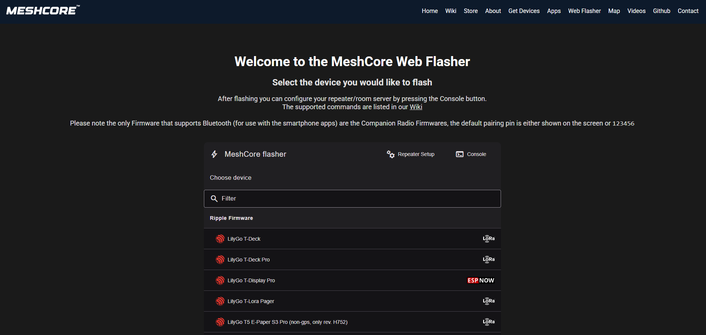

## Introduction

MeshCore is a lightweight, portable C++ library that implements multi-hop packet routing for embedded projects using LoRa and other packet radios. It's specifically designed for developers who want to create resilient, decentralized communication networks that work without internet connectivity.

> Learn more at [MeshCore](https://github.com/meshcore-dev/MeshCore)

MeshCore now supports a range of LoRa devices, making it easy to flash without manually compiling firmware. Users can flash pre-built binaries using tools like Adafruit ESPTool and interact with the network through the serial console. MeshCore provides the capability to create wireless mesh networks, similar to Meshtastic and Reticulum, but focuses on lightweight multi-hop packet routing for embedded projects. Unlike Meshtastic, which is tailored for casual LoRa communication, or Reticulum, which offers advanced networking, MeshCore balances simplicity with scalability, making it ideal for custom embedded solutions where devices (nodes) can relay messages over long distances through intermediate nodes. This is particularly useful in off-grid, emergency, or tactical scenarios where traditional communication infrastructure is unavailable.

## Features

- Multi-hop Packet Routing
  - Devices can forward messages across multiple nodes, extending range beyond a single radio's coverage.
  - Supports configurable hop counts to balance network efficiency and prevent excessive traffic.
  - Nodes use fixed roles where "companion" nodes don't relay messages at all to prevent using disadvantageous routing paths.
- LoRa Radio Support – Compatible with Heltec, RAK Wireless, and other LoRa-based hardware.
- Decentralized and Resilient – No central servers or internet required; the network is self-healing.
- Low Power Consumption – Ideal for battery-powered or solar-powered devices.
- Easy Deployment – Pre-built example applications make getting started straightforward.

## Use Cases

- Off-grid Communication: Stay connected even in remote areas. MeshCore devices can communicate wirelessly with other devices without internet connectivity.
- Emergency Response and Disaster Recovery: Establish instant networks when infrastructure fails.
- Outdoor Activities: Hiking, camping, and adventure racing communications.
- Tactical and Security Applications: Military, law enforcement, and private security use cases.
- IoT and Sensor Networks: Collect data from remote sensors and relay it back to a central location.

## Supported Devices

- T-Deck
- T-Deck Pro
- T-Display Pro
- T-LoRa Pager
- T5 E-Paper S3 Pro
- LoRa32 V1.6.1
- T-Beam (SX1262)
- T-Beam 1.2 (SX1276)
- T-Beam Supreme (SX1262)
- T-Deck (community)
- T-Echo
- T-Echo Lite
- T3 S3 (SX126X)
- T3 S3 (SX127X)

## Download Firmware

1. Open the web download page: [MeshCore](https://flasher.meshcore.co.uk/)
2. Select your supported device
3. Flash one of the firmware types:
   - Companion
   - Repeater
   - Room Server

Companion firmware can connect via BLE, USB, or WiFi, depending on which firmware type you flash.
- Web: https://app.meshcore.nz
- Android: https://play.google.com/store/apps/details?id=com.liamcottle.meshcore.android
- iOS: https://apps.apple.com/us/app/meshcore/id6742354151?platform=iphone
- NodeJS: https://github.com/liamcottle/meshcore.js
- Python: https://github.com/fdlamotte/meshcore-cli

Visit [MeshCore FAQ](https://github.com/meshcore-dev/MeshCore/blob/main/docs/faq.md) for more information.