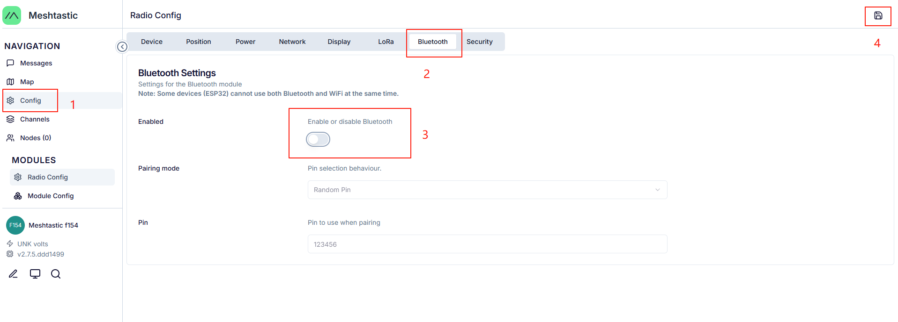

## Meshtastic Bluetooth

Meshtastic Bluetooth is disabled by default.
If you need to enable it for device download, you can control the device to turn it on via the web version:

1.Open the download interface on the[meshtastic official website](https://meshtastic.org/downloads/)

2.Click [client.meshtastic.org](https://client.meshtastic.org/)

3.Click "Connect via serial" and "Add new device"

4.Select the serial port corresponding to the device and click "Connect"

5.Follow the steps to enable Bluetooth

>After making changes here, click the save button in the upper right corner and wait for the device to restart. Once the restart is complete, the Bluetooth function will be enabled....

