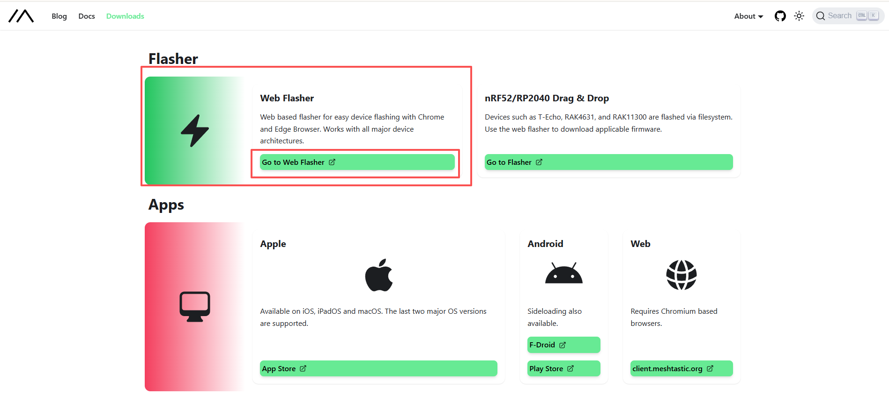

<!-- **[English](README.MD) | 中文** -->

<!-- 

    <a target="_blank" style="margin: 1em;color: white; font-size: 0.9em; border-radius: 0.3em; padding: 0.5em 2em; background-color:rgb(63, 201, 28)" href="https://item.taobao.com/item.htm?id=846226367137">Taobao</a>
    <a target="_blank" style="margin: 1em;color: white; font-size: 0.9em; border-radius: 0.3em; padding: 0.5em 2em; background-color:rgb(63, 201, 28)" href="https://www.aliexpress.com/store/911876460">AliExpress</a>

 -->

>! Learn more at [Meshtastic](https://meshtastic.org/docs/hardware/devices/lilygo/)

## Using Web Flasher

Open [meshtastic.org](https://meshtastic.org/), click the Download button

Find `Web Flasher` in the `Flasher` section

> Follow the steps to first select your device, then choose the firmware version, and click the Download button to download the firmware

> You can erase the device before downloading the firmware

> Click `update` and wait for the download to complete

## Using flash_download_tool

### Obtaining Firmware

Click the Download button in the upper right corner

Find the Firmware section, click Download Stable to go to the GitHub releases page and download the firmware

Click releases to view the latest firmware versions

After confirming the firmware version, click to view details, scroll down to find Assets and download the firmware

Download the corresponding firmware based on your chip model

### Tool Acquisition

After downloading the firmware, you need to flash it to the development board. We recommend using the Flash_Download_Tool for flashing

Click [Download Flash_Download_Tool](https://docs.espressif.com/projects/esp-test-tools/en/latest/esp32/production_stage/tools/flash_download_tool.html)

### Flashing Firmware
Select the corresponding chip model and firmware file, then click Start to begin flashing

