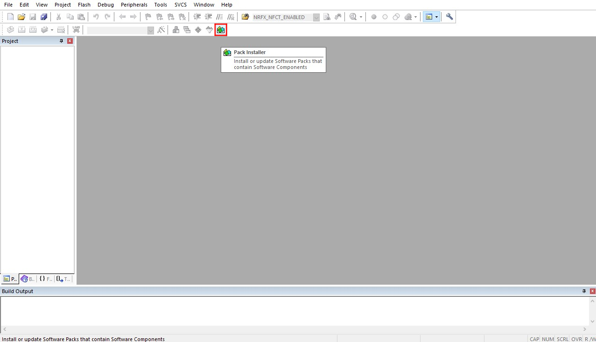
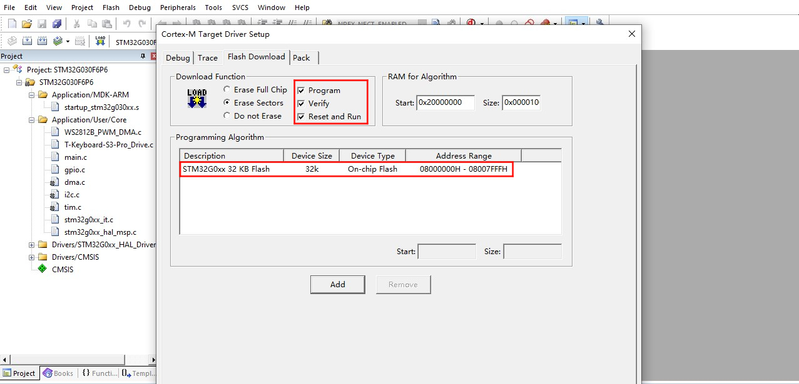

    <a target="_blank" style="margin: 1em;color: white; font-size: 0.9em; border-radius: 0.3em; padding: 0.5em 2em; background-color:rgb(63, 201, 28)" href="https://lilygo.cc/products/t-keyboard-s3-pro">官网购买</a>

> **重要提示**：使用时必须要有主机，从机通过磁吸接口与主机连接。

## 版本迭代:
| Version    | Update date    | Update description  |
| :-----------: | :-----------: | :-----------: |
| T-Keyboard-S3-Pro_MCU_V1.1 | 2024-09-05              | Original version |
| T-Keyboard-S3-Pro_Keyboard_V1.1| 2024-09-05        | Original version |
| T-Keyboard-S3-Pro_Magnet_Female_V1.0| 2024-09-05        | Original version |
| T-Keyboard-S3-Pro_Magnet_Male_V1.0| 2024-09-05        | Original version |
| T-Keyboard-S3-Pro_Keyboard_LCD_FPC_V1.0| 2024-09-05        | Original version |

## 购买链接

| Product | Main SOC | Co-processor | FLASH | PSRAM | Link |
| :-----: | :--: | :---: | :---: | :---: | :--: |
| T-Keyboard S3 Pro | ESP32-S3 | STM32G030 | 16M | 8M (Octal SPI) | [LILYGO Mall](https://lilygo.cc/products/t-keyboard-s3-pro) |

## 目录
- [描述](#描述)
- [预览](#预览)
- [模块](#模块)
- [快速开始](#快速开始)
- [常见问题](#常见问题)
- [项目](#项目)

## 描述

T-Keyboard-S3 Pro 是一款基于双 MCU 架构（ESP32-S3 + STM32G030F6P6）的高端可编程键盘，专为开发者与专业用户打造。其核心亮点包括 4 块 0.85 英寸 RGB LCD 屏幕（分辨率 128x128），支持多屏独立显示快捷指令、系统状态或动态交互界面；4 个热插拔机械按键兼容自定义轴体，搭配 RGB WS2812 灯效与旋转编码器，可编程背光模式及精准参数调节（如音量、滚动控制）。硬件上，主控 ESP32-S3 配备 16MB Flash + 8MB PSRAM，支持 Wi-Fi/蓝牙通信与复杂逻辑运算，外置 STM32 芯片辅助处理实时输入任务，确保低延迟响应。扩展性方面，提供 STEMMA QT/Qwlic 接口及磁吸扩展能力，可连接多个从机设备，打造多功能控制终端。

## 预览

### 实物图

### 引脚图

## 模块

###  主要的MCU

* 模块：ESP32­-S3-WROOM­-1
* 芯片：ESP32-S3-R8
* PSRAM：8M (Octal SPI)
* FLASH：16M
* 相关资料：
    >[ESP32-S3­-WROOM­-1_datasheet](https://www.espressif.com/sites/default/files/documentation/esp32-s3-wroom-1_wroom-1u_datasheet_en.pdf)
* 依赖库：
    >[Arduino_DriveBus-1.1.16]()

###  次要的MCU

* 芯片：STM32G030F6P6
* SRAM：8 Kbytes
* FLASH：64 Kbytes
* 相关资料：
    >[STM32G030F6_datasheet](https://www.st.com/en/microcontrollers-microprocessors/stm32g030f6.html#documentation)

###  屏幕

* 屏幕型号：N085-1212TBWIG06-C08
* 尺寸：0.85英寸
* 分辨率：128x128px
* 屏幕类型：TFT
* 驱动芯片：GC9107
* 使用总线通信协议：标准SPI
* 其他说明：所有屏幕的RST、DC、MOSI、SCLK、BL引脚各共用一条总线，初始化复位时候所有屏幕一起复位，选择不同CS线即可控制不同的屏幕刷新数据
* 相关资料：
    >[GC9107_DataSheet_V1.2](./information/GC9107_DataSheet_V1.2.pdf)
* 依赖库：
    >[TFT_eSPI-2.5.0](https://github.com/Bodmer/TFT_eSPI)  
    >[lvgl-8.3.5](https://github.com/lvgl/lvgl)   
    >[Arduino_GFX-1.3.7](https://github.com/moononournation/Arduino_GFX)  

###  热插拔按键

* 规格：选用的热插拔连接器是Kailh公司的连接器，两引脚间距是6.35MM，满足间距为6.35mm的热插拔针脚按键都可适用
* PCB连接：下拉使能低电平作为判断信号，主机的KEY5复用为BOOT-0作为系统上电模式选择，默认有一个10K上拉电阻，同样以低电平作为判断信号，软件内必须配置其引脚为内部上拉才能稳定使用
* 其他说明：因为要连接屏幕，所以请务必选择中间有开孔的热插拔按键，间距应该大于排线宽度7MM以上

###  板载LED

* 芯片：WS2812C
* 相关资料：
    >[WS2812C-2020](./information/WS2812C-2020.pdf)

### 旋转编码器

* 描述：四脚铜顶针旋钮

### 概述

| 组件 | 描述 |
| :--: | :--: |
| 主处理器 | ESP32-S3R8 Dual-core LX7 microprocessor |
| 协处理器 | STM32G030F6P6 |
| Flash | 16MB (ESP32-S3) + 64KB (STM32) |
| PSRAM | 8MB (ESP32-S3) + 8KB (STM32) |
| 屏幕 | 4×0.85英寸 GC9107 TFT LCD (128×128) |
| 按键 | 4×热插拔机械按键 + 旋转编码器 |
| RGB灯效 | WS2812C |
| GPS | MIA-M10Q |
| 存储 | TF卡 |
| 无线 | Wi-Fi 802.11 b/g/n + BLE 5 |
| USB | 1 × Type-C接口 |
| 拓展接口 | 2×QWIIC + 4×磁吸接口 |
| 按键 | RST + BOOT + 4×屏幕按键 |
| UI框架 | LVGL |
| 尺寸 | **164×46×42mm** |

## 快速开始

### 使用注意事项

1. **I2C通信扩展**：默认固件配置为 I2C 通信扩展模式。扩展从设备时，必须确保每个设备具有唯一的 I2C 地址，避免地址冲突。
2. **设备数量限制**：最多可连接 6 个设备。连接多个设备时，需要将板载 LED 的最大亮度调低至 10。
3. **扩展方向限制**：主控板左右两侧各只能扩展一个设备，向下最多可扩展两个设备（USB 接口会阻碍扩展），最多可形成 2×3 的网格布局。

>根据版本选择对应的示例程序。
###  ESP32S3 主机设备软件引导

| Branch | `[PlatformIO (arduino-espressif32_v6.5.0)]` `[Arduino IDE (arduino-esp32-lib_v2.0.14)]`   Support |Description   |
| :-----------: | :-----------: | :-----------: | 
|[arduino-esp32-libs_v2.0.14](https://github.com/Xinyuan-LilyGO/T-Keyboard-S3-Pro/tree/arduino-esp32-libs_V2.0.14)| 
  
 | 基于Arduino语言库版本为v2.0.14编写的ESP32S3相关示例程序 |

#### 示例

| Example | Description | Picture |
| ------  | ------ | ------ | 
| [GFX](./examples/GFX) |  |  |
| [IIC_Scan_2](./examples/IIC_Scan_2) |  |  |
| [Keyboard](./examples/Keyboard) |  |  |
| [Original_Test](./examples/Original_Test) |  |  |
| [Original_Test_2](./examples/Original_Test_2) | 出厂初始测试文件 |  |
| [Rotary_Encoder](./examples/Rotary_Encoder) |  |  |
| [T-Keyboard-S3-Pro_IIC_Command](./examples/T-Keyboard-S3-Pro_IIC_Command) |  |  |
| [T-Keyboard-S3-Pro_IIC_Scan](./examples/T-Keyboard-S3-Pro_IIC_Scan) |  |  |
| [Shortcut-Keys](./examples/Shortcut-Keys) |  |  |
| [Lvgl_UI](./examples/Lvgl_UI) | 出厂初始测试文件 |  |

| Firmware | Description | Picture |
| ------  | ------  | ------ |
| [Original_Test_2](./firmware/[ESP32S3][T-Keyboard-S3-Pro_V1.0][Original_Test_2]_firmware_V1.0.0.bin) | 主机设备出厂初始测试文件 |  |
| [Lvgl_UI](./firmware/[ESP32S3][T-Keyboard-S3-Pro_V1.0][Lvgl_UI]_firmware_V1.0.0.bin) | 主机设备出厂初始测试文件 |  |

#### PlatformIO
1. 安装[VisualStudioCode](https://code.visualstudio.com/Download)，根据你的系统类型选择安装。

2. 打开VisualStudioCode软件侧边栏的“扩展”（或者使用<kbd>Ctrl</kbd>+<kbd>Shift</kbd>+<kbd>X</kbd>打开扩展），搜索“PlatformIO IDE”扩展并下载。

3. 在安装扩展的期间，你可以前往GitHub下载程序，你可以通过点击带绿色字样的“<> Code”下载主分支程序，也通过侧边栏下载“Releases”版本程序。

4. 扩展安装完成后，打开侧边栏的资源管理器（或者使用<kbd>Ctrl</kbd>+<kbd>Shift</kbd>+<kbd>E</kbd>打开），点击“打开文件夹”，找到刚刚你下载的项目代码（整个文件夹），点击“添加”，此时项目文件就添加到你的工作区了。

5. 打开项目文件中的“platformio.ini”（添加文件夹成功后PlatformIO会自动打开对应文件夹的“platformio.ini”）,在“[platformio]”目录下取消注释选择你需要烧录的示例程序（以“default_envs = xxx”为标头），然后点击左下角的“<kbd>[√](image/4.png)</kbd>”进行编译，如果编译无误，将单片机连接电脑，点击左下角“<kbd>[→](image/5.png)</kbd>”即可进行烧录。

#### Arduino
1. 安装[Arduino](https://www.arduino.cc/en/software)，根据你的系统类型选择安装。

2. 打开项目文件夹的“example”目录，选择示例项目文件夹，打开以“.ino”结尾的文件即可打开Arduino IDE项目工作区。

3. 打开右上角菜单栏->选择“开发板”->“开发板管理器”，找到或者搜索“esp32”，下载作者名为"Espressif Systems"的开发板文件。接着返回“开发板”菜单栏，选择"ESP32 Arduino"开发板下的开发板类型，选择的开发板类型由“platformio.ini”文件中以[env]目录下的“board = xxx”标头为准，如果没有对应的开发板，则需要自己手动添加项目文件夹下“board”目录下的开发板。

4. 打开菜单栏“[文件]”->“[首选项]”，找到“[项目文件夹位置]”这一栏，将项目目录下的“libraries”文件夹里的所有库文件连带文件夹复制粘贴到这个目录下的“libraries”里边。

5. 在 "工具 "菜单中选择正确的设置，如下表所示。

##### ESP32-S3
| Setting                               | Value                                 |
| :-------------------------------: | :-------------------------------: |
| Board                                 | ESP32S3 Dev Module           |
| Upload Speed                     | 921600                               |
| USB Mode                           | Hardware CDC and JTAG     |
| USB CDC On Boot                | Enabled                              |
| USB Firmware MSC On Boot | Disabled                             |
| USB DFU On Boot                | Disabled                             |
| CPU Frequency                   | 240MHz (WiFi)                    |
| Flash Mode                         | QIO 80MHz                         |
| Flash Size                           | 16MB (128Mb)                    |
| Core Debug Level                | None                                 |
| Partition Scheme                | Default (6.25MB APP/3.43MB SPIFFS) |
| PSRAM                                | OPI PSRAM                         |
| Arduino Runs On                  | Core 1                               |
| Events Run On                     | Core 1                               |        

6. 选择正确的端口。

7. 点击右上角“<kbd>[√]</kbd>”进行编译，如果编译无误，将单片机连接电脑，点击右上角“<kbd>[→]</kbd>”即可进行烧录。

#### 引脚总览

| IIC_1引脚  | ESP32S3引脚|
| :------------------: | :------------------:|
| SDA         | IO42     |
| SCL         | IO2       |

| IIC_2引脚（外扩）  | ESP32S3引脚|
| :------------------: | :------------------:|
| SDA         | IO6       |
| SCL         | IO7       |

| LCD屏幕引脚  | ESP32S3引脚|
| :------------------: | :------------------:|
| MOSI         | IO40       |
| SCLK         | IO41       |
| DC         | IO39       |
| RST         | IO38       |
| BL         | IO1       |

| 旋转编码器引脚  | ESP32S3引脚|
| :------------------: | :------------------:|
| KNOB_DATA_A         | IO4       |
| KNOB_DATA_B         | IO5       |
| KNOB_DATA_KEY         | IO0       |

###  STM32 从机设备软件引导

| Branch | `[STM32CubeMX (stm32cubeg0-firmware-package_v1.6.2)]` `[ARM Keil μVision5 (Keil.STM32G0xx_DFP.1.4.0.pack)]`   Support  |Description   |
| :-----------: | :-----------: | :-----------: | 
|[stm32cubeg0-firmware-package_v1.6.2](https://github.com/Xinyuan-LilyGO/T-Keyboard-S3-Pro/tree/stm32cubeg0-firmware-package_V1.6.2)|  
  
  | 基于stm32cubeg库版本为v1.6.2、芯片库版本为v1.4.0编写的STM32相关示例程序 |

#### 示例支持

| Example | Description | Picture |
| ------  | ------ | ------ | 
| [KEY](https://github.com/Xinyuan-LilyGO/T-Keyboard-S3-Pro/edit/stm32cubeg0-firmware-package_V1.6.2/examples/KEY) |  |  |
| [Original_Test](https://github.com/Xinyuan-LilyGO/T-Keyboard-S3-Pro/edit/stm32cubeg0-firmware-package_V1.6.2/examples/Original_Test) | 出厂初始测试文件 |  |
| [T-Keyboard-S3-Pro_IIC_Command](https://github.com/Xinyuan-LilyGO/T-Keyboard-S3-Pro/edit/stm32cubeg0-firmware-package_V1.6.2/examples/T-Keyboard-S3-Pro_IIC_Command) |  |  |
| [WS2812B](https://github.com/Xinyuan-LilyGO/T-Keyboard-S3-Pro/edit/stm32cubeg0-firmware-package_V1.6.2/examples/WS2812B) |  |  |

| Firmware | Description | Picture |
| ------  | ------  | ------ |
| [Slave_0x01_Original_Test_V1.0.0](https://github.com/Xinyuan-LilyGO/T-Keyboard-S3-Pro/edit/stm32cubeg0-firmware-package_V1.6.2/firmware/（修复LED的HUE值设置失败问题）[STM32G030F6P6_Drive_0x01][T-Keyboard-S3-Pro_V1.0][Original_Test]_firmware_V2_202501231722.hex) | 出厂时从机设备0x01的初始测试文件 |  |
| [Slave_0x02_Original_Test_V1.0.0](https://github.com/Xinyuan-LilyGO/T-Keyboard-S3-Pro/edit/stm32cubeg0-firmware-package_V1.6.2/firmware/（修复LED的HUE值设置失败问题）[STM32G030F6P6_Drive_0x02][T-Keyboard-S3-Pro_V1.0][Original_Test]_firmware_V2_202501231722.hex) | 出厂时从机设备0x01的初始测试文件 |  |
| [Slave_0x03_Original_Test_V1.0.0](https://github.com/Xinyuan-LilyGO/T-Keyboard-S3-Pro/edit/stm32cubeg0-firmware-package_V1.6.2/firmware/（修复LED的HUE值设置失败问题）[STM32G030F6P6_Drive_0x03][T-Keyboard-S3-Pro_V1.0][Original_Test]_firmware_V2_202501231722.hex) | 出厂时从机设备0x01的初始测试文件 |  |
| [Slave_0x04_Original_Test_V1.0.0](https://github.com/Xinyuan-LilyGO/T-Keyboard-S3-Pro/edit/stm32cubeg0-firmware-package_V1.6.2/firmware/（修复LED的HUE值设置失败问题）[STM32G030F6P6_Drive_0x04][T-Keyboard-S3-Pro_V1.0][Original_Test]_firmware_V2_202501231722.hex) | 出厂时从机设备0x01的初始测试文件 |  |
| [Slave_0x05_Original_Test_V1.0.0](https://github.com/Xinyuan-LilyGO/T-Keyboard-S3-Pro/edit/stm32cubeg0-firmware-package_V1.6.2/firmware/（修复LED的HUE值设置失败问题）[STM32G030F6P6_Drive_0x05][T-Keyboard-S3-Pro_V1.0][Original_Test]_firmware_V2_202501231722.hex) | 出厂时从机设备0x01的初始测试文件 |  |
| [Slave_0x06_Original_Test_V1.0.0](https://github.com/Xinyuan-LilyGO/T-Keyboard-S3-Pro/edit/stm32cubeg0-firmware-package_V1.6.2/firmware/（修复LED的HUE值设置失败问题）[STM32G030F6P6_Drive_0x06][T-Keyboard-S3-Pro_V1.0][Original_Test]_firmware_V2_202501231722.hex) | 出厂时从机设备0x01的初始测试文件 |  |

#### STM32CubeMX
1. 安装[JAVA](https://www.java.com/en/download/)，安装STM32CubeMX前需要安装JAVA。

2. 安装[STM32CubeMX](https://www.st.com/en/development-tools/stm32cubemx.html)，根据你的系统类型选择安装。

3. 打开STM32CubeMX，找到菜单栏中的“Help->Manage embedded software packages”打开软件包管理，选择“STM32G0”的软件包，下载按安装对应版本的软件包即可。

4. 以上准备工作完成后你就可以使用STM32CubeMX来配置你的工程项目了。示例代码中有包含STM32CubeMX配置好的项目文件，打开示例文件夹中后缀名为“.ioc”的文件就是。

#### ARM Keil μVision5
1. 安装[ARM Keil μVision5](https://www.keil.arm.com/mdk-community/)，根据你的系统类型选择安装。

2. 打开Keil，找到菜单栏的“Pack Installer”

选项打开软件包管理器，在软件包管理器页面搜索“STM32G0”，选择1.4.0版本的软件库安装。

3. 安装好使用的调试器驱动，调试器的支持类型可以在Keil的菜单栏的“Options for”中的“Debug”栏中找到，此外还需要设置好“programming algorithm”如下图所示。

    

板子上的STM32G0的调试口在“T-Keyboard-S3-Pro_Keyboard”板子的背面如下图

    

4. 打开示例目录下的任意一个后缀名为“.uvprojx”的示例，点击菜单栏的“Rebuild”构建并插上调试器连接好设备点击“Download”下载程序

#### STM32CubeProgrammer
1. 安装[STM32CubeProgrammer](https://www.st.com/en/development-tools/stm32cubeprog.html)，根据你的系统类型选择安装。

2. 打开STM32CubeMX，选择正确的调试器，这里以STLINK为例子， 如下图红框所示配置，选择要下载的firmware文件，点击“Start Programming”开始下载。使用UART下载同理。

    

板子上的UART的调试口在“T-Keyboard-S3-Pro_Keyboard”板子的背面如下图

    

#### 引脚总览

| IIC引脚  | STM32G0引脚|
| :------------------: | :------------------:|
| SDA         |   PC14/PB9   |
| SCL         | PB7/PB8       |

| KEY引脚  | STM32G0引脚|
| :------------------: | :------------------:|
| KEY1         | PA1       |
| KEY2         | PA0       |
| KEY3         | PC15       |
| KEY4         | PB3/PB4/PB5/PB6       |
| KEY5         | PA12[PA10]       |

| LCD屏幕引脚  | STM32G0引脚|
| :------------------: | :------------------:|
| LCD_CS1         |     PA4       |
| LCD_CS2         | PA11[PA9]       |
| LCD_CS3         | PB0/PB1/PB2/PA8       |
| LCD_CS4         | PA6       |
| LCD_CS5         | PA5       |

| LED灯引脚  | STM32G0引脚|
| :------------------: | :------------------:|
| WS2812B_DATA         |     PA7       |

## 常见问题

*   **Q. T-Keyboard S3 Pro的主要特点是什么？**
    A. 这是一款高端可编程键盘，具有4块独立LCD屏幕、热插拔机械按键、RGB灯效、旋转编码器和强大的双MCU架构，支持多设备磁吸扩展。

*   **Q. 如何扩展从机设备？**
    A. 通过磁吸接口连接从机设备，最多支持6个设备组成2×3网格布局。注意每个从机必须有唯一的I2C地址。

*   **Q. 热插拔机械按键支持哪些轴体？**
    A. 支持标准的热插拔机械轴体，兼容大多数MX结构的机械轴。

*   **Q. 多屏幕显示如何工作？**
    A. 4块屏幕可以独立显示不同的内容，如系统状态、快捷指令、媒体控制等，通过SPI接口驱动。

*   **Q. 双MCU架构有什么优势？**
    A. ESP32-S3处理复杂的图形界面和无线通信，STM32负责实时输入处理，确保低延迟的按键响应。

*   **Q. 扩展多个设备时需要注意什么？**
    A. 连接多个设备时需要将LED亮度调低至10，并注意扩展方向限制（左右各1个，向下最多2个）。

## 项目

* [SCH_T-Keyboard-S3-Pro_MCU_V1.1](https://github.com/Xinyuan-LilyGO/T-Keyboard-S3-Pro/blob/main/project/SCH_T-Keyboard-S3-Pro_MCU_V1.1.pdf)
* [SCH_T-Keyboard-S3-Pro_Keyboard_V1.1](https://github.com/Xinyuan-LilyGO/T-Keyboard-S3-Pro/blob/main/project/SCH_T-Keyboard-S3-Pro_Keyboard_V1.1.pdf)
* [SCH_T-Keyboard-S3-Pro_Magnet_Female_V1.0](https://github.com/Xinyuan-LilyGO/T-Keyboard-S3-Pro/blob/main/project/SCH_T-Keyboard-S3-Pro_Magnet_Female_V1.0.pdf)
* [SCH_T-Keyboard-S3-Pro_Magnet_Male_V1.0](https://github.com/Xinyuan-LilyGO/T-Keyboard-S3-Pro/blob/main/project/SCH_T-Keyboard-S3-Pro_Magnet_Male_V1.0.pdf)
* [SCH_T-Keyboard-S3-Pro_Keyboard_LCD_FPC_V1.0](https://github.com/Xinyuan-LilyGO/T-Keyboard-S3-Pro/blob/main/project/SCH_T-Keyboard-S3-Pro_Keyboard_LCD_FPC_V1.0.pdf)

## 资料

*   [ESP32-S3-WROOM-1 Datasheet](https://www.espressif.com/sites/default/files/documentation/esp32-s3-wroom-1_wroom-1u_datasheet_en.pdf)
*   [STM32G030F6P6 Datasheet](https://www.st.com/en/microcontrollers-microprocessors/stm32g030f6.html#documentation)
*   [GC9107 Datasheet](https://github.com/Xinyuan-LilyGO/T-Keyboard-S3-Pro/blob/main/information/GC9107_DataSheet_V1.2.pdf)
*   [WS2812C Datasheet](https://github.com/Xinyuan-LilyGO/T-Keyboard-S3-Pro/blob/main/information/WS2812C-2020.pdf)

## 依赖库
*   [RadioLib](https://github.com/jgromes/RadioLib)
*   [TFT_eSPI](https://github.com/Bodmer/TFT_eSPI)
*   [LVGL](https://github.com/lvgl/lvgl/tree/v8.4.0)
*   [Arduino_GFX](https://github.com/moononournation/Arduino_GFX)