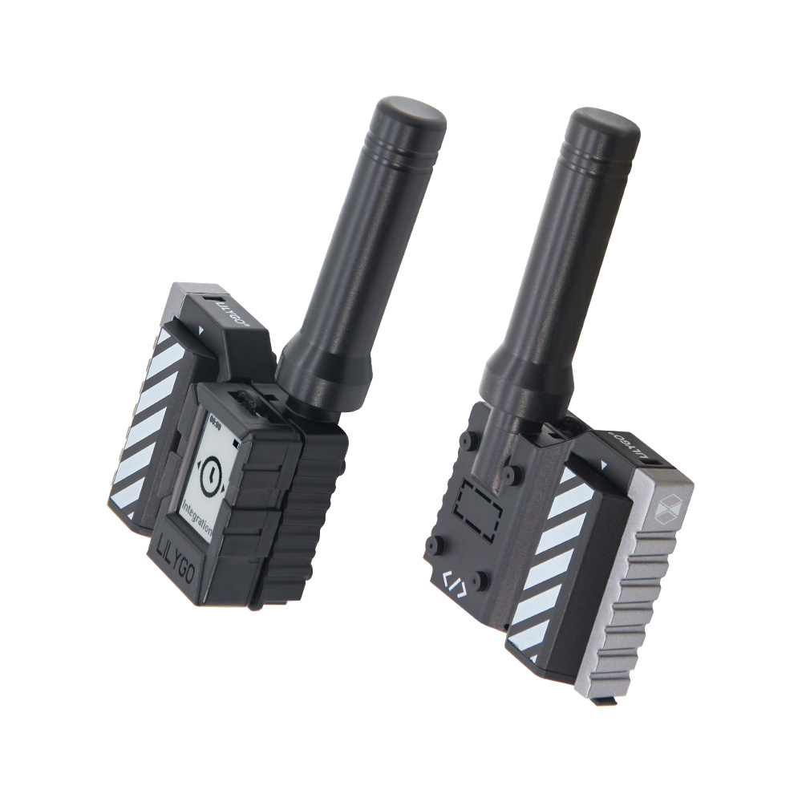

<!-- **[English](README.MD) | 中文** -->

    <a target="_blank" style="margin: 1em;color: white; font-size: 0.9em; border-radius: 0.3em; padding: 0.5em 2em; background-color:rgb(63, 201, 28)" href="https://lilygo.cc/products/t-mini-epaper-s3">官网购买</a>
    <!-- <a target="_blank" style="margin: 1em;color: white; font-size: 0.9em; border-radius: 0.3em; padding: 0.5em 2em; background-color:rgb(63, 201, 28)" href="https://www.aliexpress.com/store/911876460">速卖通</a>-->

 

## 简介

LILYGO T-MINI E-Paper S3 Kit 是一款紧凑型（102x24.5x53mm）多功能开发板，搭载 ESP32-S3FN4R2 双核处理器（支持 Wi-Fi/蓝牙 5）。其核心亮点在于集成了低功耗 1.02 英寸电子墨水屏（128x80 分辨率）、支持 868/915/923MHz 频段的 SX1262 LoRa 远距离通信模块，以及 3.7V 18350 锂电池供电。板载功能还包括 TF 卡存储扩展、PCF85063ATL RTC 实时时钟、丰富的 GPIO 接口（SPI/I2C等），并支持深度睡眠。非常适用于构建 远程环境监测节点、低功耗信息显示标签、便携式数据记录器等物联网应用场景。

## 外观及功能介绍
### 外观

### 引脚图 

## 模块资料以及参数
### 开发板参数

| 组件 | 描述 |
| ---  | --- |
|MCU	|ESP32-S3FN4R2 Dual-core LX7 microprocessor
|Flash 	|	4MB 
|PSRAM  |	2MB
|Lora|	SX1262 868Mhz/915Mhz/923Mhz(可选)
|RTC	|PCF85063ATL
|无线| 2.4 GHz Wi-Fi & Bluetooth 5 (LE)
|存储 | TF 卡 |
|屏幕| 1.02英寸电子墨水屏 128x80分辨率
|电池 |	18350 3.7V锂电池
|按键 | 1 x RST 按键 + 1 x BOOT 按键 |
|USB |1 × type-C接口|
| 拓展接口 |1 x LoRa天线接口 + 1 x QWIIC 接口|
| 尺寸 | **102x24.5x53 mm**  |
| 孔位| **M1 *4** |

### 相关资料

Github：[LilyGO-Mini-Epaper-S3](https://github.com/Xinyuan-LilyGO/LilyGO-Mini-Epaper-S3)

#### 原理图

[LilyGO-Mini-Epaper-S3](https://github.com/Xinyuan-LilyGO/LilyGO-Mini-Epaper-S3/blob/main/schematic/Mini-Epaper-S3-V1.2.pdf)

[LoRa Shield](https://github.com/Xinyuan-LilyGO/LilyGO-Mini-Epaper-S3/blob/main/schematic/Mini%20e-paper-LoRa%20Shield_Schematic.pdf)

#### 依赖库

* [AceButton](https://github.com/bxparks/AceButton)
* [RadioLib](https://github.com/jgromes/RadioLib)
* [adafruit_NeoPixel](https://github.com/adafruit/Adafruit_NeoPixel)
* [arduino_json](https://github.com/bblanchon/ArduinoJson)
* [Adafruit_GFX_Library](https://github.com/adafruit/Adafruit-GFX-Library)
* [BMA423](https://github.com/BoschSensortec/BMA423-Sensor-API)
* [GxEPD](https://github.com/bot1131357/GxEPD)
* [Mecha_QMC5883L-master](https://github.com/bot1131357/Mecha_QMC5883L-master)
* [PCF8563_library](https://github.com/lewisxhe/PCF8563_Library)
* [QMC5883LCompass](https://github.com/mprograms/QMC5883LCompass)

## 软件开发
### Arduino 设置参数

|Arduino IDE 设置	|参数   
| ----------- | -----------|                         
|Board     |	ESP32S3 Dev Module
|Port      |    Your port                        
|USB CDC On Boot	|Enable
|CPU Frequency	|240MHZ(WiFi)                      
|Core Debug Level	|None                              
|USB DFU On Boot	|Disable                          
|Erase All Flash Before Sketch Upload	|Disable                          
|Events Run On	|Core1                            
|Flash Mode	|QIO 80MHZ                        
|Flash Size	|4MB(32Mb)                  
|Arduino Runs On	|Core1                            
|USB Firmware MSC On Boot	|Disable                          
|Partition Scheme|Default 4MB with spiffs (1.5MB APP/1.5MB SPIFFS)                          
|PSRAM	|QSPI PSRAM                    
|Upload Mode	|UART0/Hardware CDC            
|Upload Speed	|921600                            
|USB Mode	|CDC and JTAG      

### 开发平台
1. [VS Code](https://code.visualstudio.com/)
2. [Arduino IDE](https://www.arduino.cc/en/software)
3. [Platform IO](https://platformio.org/)
4. [Micropython](https://micropython.org/)

## 产品技术支持 

