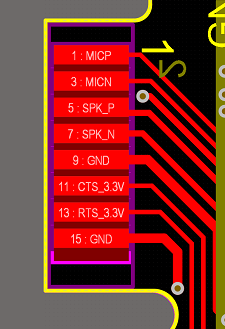

<!-- **[English](README.MD) | 中文** -->

<!--  -->

<!-- 

    <a target="_blank" style="margin: 1em;color: white; font-size: 0.9em; border-radius: 0.3em; padding: 0.5em 2em; background-color:rgb(63, 201, 28)" href="https://item.taobao.com/item.htm?id=846226367137">淘宝</a>
    <a target="_blank" style="margin: 1em;color: white; font-size: 0.9em; border-radius: 0.3em; padding: 0.5em 2em; background-color:rgb(63, 201, 28)" href="https://www.aliexpress.com/store/911876460">速卖通</a>

 -->

## 简介

## 芯片型号
### SIM7600E

SIM7600E-PCIE 是一款 LTE Cat 1 模块，支持 LTE-TDD/LTE-FDD/HSPA+/GSM/GPRS/EDGE 等多种无线通信模式。其最大下行速率可达 10Mbps，最大上行速率可达 5Mbps。

T-SIM7600E-PCIE 采用 mini PCIe 外形规格，由一个 SIM7600 系列模块和一个 mini PCIe 适配板组成，便于客户集成。

该模块集成了多种卫星高精度定位 (GNSS) 系统，内置多种网络协议，支持主流操作系统（如 Windows、Linux 和 Android 等的 USB 驱动程序）及软件功能。其 AT 命令与 SIM7500/SIM7600-H 系列模块兼容。

同时，SIM7600-PCIE 系列集成了主要的工业标准接口，具备强大的扩展能力，提供包括 UART、USB、GPIO 等在内的丰富接口，适用于车联网 (telematics)、监控设备、客户终端设备 (CPE)、工业路由器、远程诊断等主要的物联网 (IoT) 应用场景。

规格书: [SIM7600E](https://github.com/Xinyuan-LilyGO/LilyGoLib/blob/master/Files/T-SIM7600E-PCIE.pdf)

#### 外观

#### 引脚定义 

  <!-- 左侧两张图片 -->
   

    
      
  

  
  <!-- 右侧两张图片 -->
   

    
    
  

### 引脚图 

## 模块资料
### 概述

### 相关资料链接

Github:[T-PCIE](https://github.com/Xinyuan-LilyGO/LilyGo-T-PCIE)

#### 原理图

[T-PCIE](https://github.com/Xinyuan-LilyGO/LilyGo-T-PCIE/blob/master/schematic/T-PCIE-V1.2.pdf)

#### 依赖库

## 软件开发
### Arduino 设置参数

### 开发平台

1. [ESP-IDF](https://www.espressif.com/zh-hans/products/sdks/esp-idf)
2. [Arduino IDE](https://www.arduino.cc/en/software)
3. [VS Code](https://code.visualstudio.com/)
4. [Platform IO](https://platformio.org/)

## 产品技术支持 

