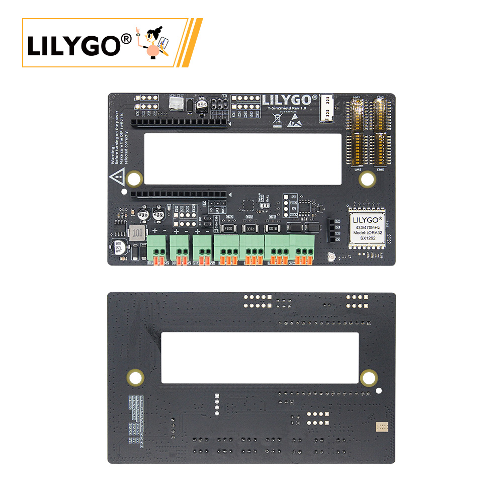

    <a target="_blank" style="margin: 1em;color: white; font-size: 0.9em; border-radius: 0.3em; padding: 0.5em 2em; background-color:rgb(63, 201, 28)" href="https://lilygo.cc/products/sim-shield">官网购买</a>

## 版本迭代:
| Version | Update date | Update description |
| :-----: | :---------: | :---------------- |
| T-SimShield-Rev1.0 | 2024-08-10 | 初始版本，支持全系列 Sim 主板 |
| T-SimShield-Rev1.1 | 2024-11-05 | 优化电源电路，增强稳定性 |

## 购买链接

| Product | 功能特性 | 兼容主板 | Link |
| :-----: | :--- | :--- | :--: |
| Sim Shield | 三路电流检测、LoRa收发、RS485、宽压输入 | 全系列 LilyGo T-Sim 主板 | [LILYGO Mall](https://lilygo.cc/products/sim-shield) |

## 目录
- [概述](#概述)
- [电气参数](#电气参数)
- [主板兼容配置](#主板兼容配置)
- [接口说明](#接口说明)
- [使用示例](#使用示例)
- [原理图与资料](#原理图与资料)

## 概述

Sim Shield 是专为 **LilyGo T-Sim 系列** 开发的多功能扩展板，集成了以下功能：

1. **三路电流检测**：基于 INA3221 芯片，支持独立电流监测
2. **LoRa 无线通信**：集成 SX1262 模块，支持远距离传输
3. **宽压直流输入**：支持 7~36V 直流输入，内置稳压电路
4. **RS485 接口**：硬件自动收发控制，支持工业通信
5. **I2C/SPI 扩展**：提供标准接口连接外设

> **⚠️ 重要警告：**
> 通电前必须检查跳线帽和 DIP 开关设置，错误配置可能导致硬件损坏。

## 电气参数

| 特性 | 参数 |
| :--- | :--- |
| **DC 输入电压** | 7~36V |
| **电池输入电压** | 4.2V（最大） |
| **充电电流** | 由主板提供 |
| **+5V 输出** | 最大 2A |
| **+3.3V 输出** | 由主板提供（建议负载 ≤100mA） |

## 主板兼容配置

### SIM7000G / A7670X / A7608X (ESP32 版)

| 跳线/开关 | 设置 | 说明 |
| :--- | :---: | :--- |
| J25 | IO → LP2 | 选择逻辑电平 |
| J21 | RP1 → 5V | 选择 5V 电源 |
| SW3 | ON | 启用此配置 |
| SW1/SW2/SW4 | OFF | 必须关闭 |

**适用型号：**
- [SIM7000G-ESP32](https://lilygo.cc/products/t-sim7000g)
- [A7608X-ESP32](https://lilygo.cc/products/t-a7608e-h)
- [A7670X-ESP32](https://lilygo.cc/products/t-sim-a7670e)

> **注意：** A7670X/A7608X 需移除电阻才能使用 Sim Shield，详情见[此链接](https://github.com/Xinyuan-LilyGO/LilyGo-Modem-Series/issues/160#issuecomment-2409860411)。

**引脚映射：**

| 信号 | GPIO |
| :--- | :---: |
| SIMSHIELD_MOSI | 23 |
| SIMSHIELD_MISO | 19 |
| SIMSHIELD_SCK | 18 |
| SIMSHIELD_SD_CS | 32 |
| SIMSHIELD_RADIO_BUSY | 39 |
| SIMSHIELD_RADIO_CS | 5 |
| SIMSHIELD_RADIO_IRQ | 34 |
| SIMSHIELD_RADIO_RST | 15 |
| SIMSHIELD_RS_RX | 13 |
| SIMSHIELD_RS_TX | 14 |
| SIMSHIELD_SDA | 21 |
| SIMSHIELD_SCL | 22 |

###  SIM7600X (ESP32 版)

| 跳线/开关 | 设置 | 说明 |
| :--- | :---: | :--- |
| J25 | IO → BAT | 选择电池供电 |
| J21 | RP2 → 5V | 选择 5V 电源 |
| SW3 | ON | 启用此配置 |
| SW1/SW2/SW4 | OFF | 必须关闭 |

**适用型号：**
- [SIM7600X-ESP32](https://lilygo.cc/products/t-sim7600)

**引脚映射（特殊说明）：**

| 信号 | GPIO | 复用功能 |
| :--- | :---: | :--- |
| SIMSHIELD_SD_CS | 32 | SIM7600 DTR 引脚 |
| SIMSHIELD_RADIO_IRQ | 34 | SIM7600 STATUS 引脚 |
| SIMSHIELD_RS_RX | 12 | SIM7600 LED 引脚 |

> **注意：** 这三个 GPIO 已被 Sim Shield 占用，请勿用于其他用途。

###  SIM7670G (ESP32-S3 版)

| 跳线/开关 | 设置 | 说明 |
| :--- | :---: | :--- |
| J25 | IO → LP2 | 选择逻辑电平 |
| J21 | RP1 → 5V | 选择 5V 电源 |
| SW2 | ON | 启用此配置 |
| SW1/SW3/SW4 | OFF | 必须关闭 |

**适用型号：**
- [SIM7670G-ESP32S3](https://lilygo.cc/products/t-sim-7670g-s3)

**引脚映射：**

| 信号 | GPIO |
| :--- | :---: |
| SIMSHIELD_MOSI | 15 |
| SIMSHIELD_MISO | 7 |
| SIMSHIELD_SCK | 16 |
| SIMSHIELD_SD_CS | 46 |
| SIMSHIELD_RADIO_BUSY | 38 |
| SIMSHIELD_RADIO_CS | 39 |
| SIMSHIELD_RADIO_IRQ | 6 |
| SIMSHIELD_RADIO_RST | 40 |
| SIMSHIELD_RS_RX | 41 |
| SIMSHIELD_RS_TX | 42 |
| SIMSHIELD_SDA | 2 |
| SIMSHIELD_SCL | 1 |

###  A7608X (ESP32-S3 版)

| 跳线/开关 | 设置 | 说明 |
| :--- | :---: | :--- |
| J25 | IO → LP2 | 选择逻辑电平 |
| J21 | 不连接 | - |
| SW2 | ON | 启用此配置 |
| SW1/SW3/SW4 | OFF | 必须关闭 |

**适用型号：**
- [A7608X-ESP32S3](https://lilygo.cc/products/t-a7608e-h)

**引脚映射：**

| 信号 | GPIO |
| :--- | :---: |
| SIMSHIELD_MOSI | 11 |
| SIMSHIELD_MISO | 10 |
| SIMSHIELD_SCK | 12 |
| SIMSHIELD_SD_CS | 45 |
| SIMSHIELD_RADIO_BUSY | 38 |
| SIMSHIELD_RADIO_CS | 39 |
| SIMSHIELD_RADIO_IRQ | 9 |
| SIMSHIELD_RADIO_RST | 40 |
| SIMSHIELD_RS_RX | 41 |
| SIMSHIELD_RS_TX | 42 |
| SIMSHIELD_SDA | 2 |
| SIMSHIELD_SCL | 1 |

###  SIM7080G (ESP32-S3 PMU 版)

| 跳线/开关 | 设置 | 说明 |
| :--- | :---: | :--- |
| J25 | 不连接 | - |
| J21 | 不连接 | - |
| SW4 | ON | 启用此配置 |
| SW1/SW2/SW3 | OFF | 必须关闭 |

**重要注意事项：**
1. SIM7080G 未暴露电池外接引脚，需将 18650 电池座正极焊接到指定位置
2. 必须移除主板上的 18650 电池座（与 Sim Shield 冲突）
3. 连接时 `DC5` 和 `VSYS` 引脚必须空置
4. 需焊接额外导线以支持 5V 输入（见下图）

**适用型号：**
- [SIM7080G-ESP32S3](https://lilygo.cc/products/t-sim7080-s3)

**引脚映射：**

| 信号 | GPIO |
| :--- | :---: |
| SIMSHIELD_MOSI | 11 |
| SIMSHIELD_MISO | 13 |
| SIMSHIELD_SCK | 12 |
| SIMSHIELD_SD_CS | 21 |
| SIMSHIELD_RADIO_BUSY | 48 |
| SIMSHIELD_RADIO_CS | 45 |
| SIMSHIELD_RADIO_IRQ | 8 |
| SIMSHIELD_RADIO_RST | 47 |
| SIMSHIELD_RS_RX | 2 |
| SIMSHIELD_RS_TX | 1 |
| SIMSHIELD_SDA | 44 |
| SIMSHIELD_SCL | 43 |

### 标准系列 (SIM7000G/A7670X/SIM7670G/SIM7080G)

| 跳线/开关 | 设置 | 说明 |
| :--- | :---: | :--- |
| J25 | IO → LP2 | 选择逻辑电平 |
| J21 | RP1 → 5V | 选择 5V 电源 |
| SW1 | ON | 启用此配置 |
| SW2/SW3/SW4 | OFF | 必须关闭 |

**引脚映射（通用）：**

| 信号 | GPIO |
| :--- | :---: |
| SIMSHIELD_MOSI | 11 |
| SIMSHIELD_MISO | 13 |
| SIMSHIELD_SCK | 12 |
| SIMSHIELD_SD_CS | 37 |
| SIMSHIELD_RADIO_BUSY | 15 |
| SIMSHIELD_RADIO_CS | 38 |
| SIMSHIELD_RADIO_IRQ | 14 |
| SIMSHIELD_RADIO_RST | 39 |
| SIMSHIELD_RS_RX | 40 |
| SIMSHIELD_RS_TX | 41 |
| SIMSHIELD_SDA | 3 |
| SIMSHIELD_SCL | 2 |

## 接口说明

### 电池连接

- 通过跳线帽将外部电池接口连接到主板电池接口
- **注意：** 如果外接电池，请勿在主板的 18650 插座上安装电池

### 电流监测设置

- **垂直跳线帽：** 将电池电流路由至 INA3221 通道2，可监测充放电电流
- **无跳线帽：** 监测压线端子接口电流
- **注意：** 使用电池监测时，请勿连接压线端子

### 5V 电源接口
- 2.00mm 2Pin JST 接口，用于外部供电
- 也可直接连接主板太阳能端口充电（需断开 J21 跳线）
- 建议优先使用此接口供电，电压降更低

### SD 卡接口
- Sim Shield 重新映射了 SPI 接口
- **使用 Sim Shield 后，SD 卡必须插入扩展板，而非主板**

### RS485 接口
- 硬件自动收发控制
- 建议通信波特率 ≤115200

### I2C 接口
- 支持标准 0.96 英寸 OLED 显示屏
- **注意线序：** 请确认 OLED 接口线序正确

### SPI 接口
- 暴露 SD 卡和 LoRa 模块的 SPI 总线

### 电流检测通道

| 通道 | 可用性 | 说明 |
| :--- | :---: | :--- |
| CH1 | 条件可用 | 如果电池通过跳线连接则不可用 |
| CH2 | 条件可用 | 如果选择为电池监测则压线端子不可用 |
| CH3 | 始终可用 | 自由使用 |

**端子定义：**
- **IN+**：电流流入方向
- **G**：负载 GND
- **IN-**：电流流出方向

## 使用示例

| 示例 | 描述 | 链接 |
| :--- | :--- | :--- |
| SimShield_LoRaWAN | LoRaWAN 通信示例 | [查看](https://github.com/Xinyuan-LilyGO/LilyGo-Modem-Series/tree/main/examples/SimShield_LoRaWAN/) |
| SimShield_LoRaReceive | LoRa 接收示例 | [查看](https://github.com/Xinyuan-LilyGO/LilyGo-Modem-Series/tree/main/examples/SimShield_LoRaReceive/) |
| SimShield_LoRaTransmit | LoRa 发送示例 | [查看](https://github.com/Xinyuan-LilyGO/LilyGo-Modem-Series/tree/main/examples/SimShield_LoRaTransmit/) |
| SimShieldCurrentSensor | 电流传感器示例 | [查看](https://github.com/Xinyuan-LilyGO/LilyGo-Modem-Series/tree/main/examples/SimShieldCurrentSensor/) |
| SimShieldFactory | 出厂测试程序 | [查看](https://github.com/Xinyuan-LilyGO/LilyGo-Modem-Series/tree/main/examples/SimShieldFactory/) |
| SerialRS485 | RS485 通信示例 | [查看](https://github.com/Xinyuan-LilyGO/LilyGo-Modem-Series/tree/main/examples/SerialRS485/) |

## 原理图与资料

- **原理图：** [T-SimShield-Rev1.0.pdf](https://github.com/Xinyuan-LilyGO/LilyGo-Modem-Series/tree/main/schematic/shield/T-SimShield-Rev1.0.pdf)
- **太阳能板规格：** [3D5ETR00372_233153V01_20250828.pdf](https://github.com/Xinyuan-LilyGO/LilyGo-Modem-Series/tree/main/datasheet/3D5ETR00372_233153V01_20250828.pdf)
- **兼容性列表：** 支持全系列 LilyGo T-Sim 主板

## 注意事项总结

1. 通电前务必检查跳线和 DIP 开关设置
2. 外接电池时勿安装主板 18650 电池
3. SD 卡必须插入扩展板而非主板
4. 不同主板型号引脚映射不同，请按对应表格配置
5. RS485 建议波特率 ≤115200