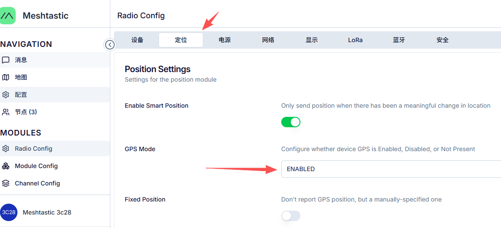
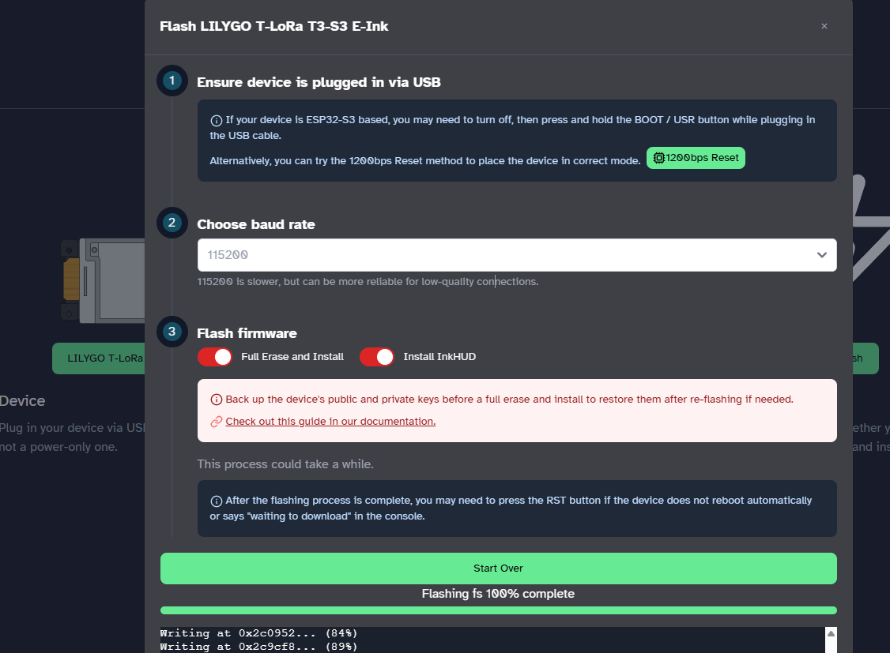

## Meshtastic Bluetooth

The Bluetooth functionality of Meshtastic devices is disabled by default.  
If you need to enable Bluetooth to download device information, you can do so via the web client:
1. Go to the downloads page on the [Meshtastic official website](https://meshtastic.org/downloads/).
2. Click the [client.meshtastic.org](https://client.meshtastic.org/) link.

3. Click "Connect via Serial" and select "Add New Device".

4. Choose the serial port corresponding to your device, then click "Connect".

5. Follow the instructions to enable Bluetooth! After making changes here,

> After completing the changes here, click the "Save" button in the top right corner and wait for the device to reboot. Once the reboot is complete, Bluetooth functionality will be enabled.

## Meshtastic GPS

Connect to your device via [meshtastic.org](https://client.meshtastic.org/) to configure and enable GPS! Select "Enable GPS" here, then click the "Save" button in the top right corner and wait for the device to reboot.

## T3-S3 E-Paper Unusable Issue

- Select the latest firmware version, check `Full Erase and Install` and `Install InkHUD`, then proceed to flash the firmware.
- Use the `Meshtastic` app to connect to the device and follow the prompts for setup.

> InkHUD is a user interface designed for Meshtastic devices equipped with e-ink displays. It aims to provide quick "at-a-glance" prompts, displaying important information clearly and working in conjunction with connected client applications. It is specifically optimized for e-ink displays, serving as an alternative to the original OLED user interface.