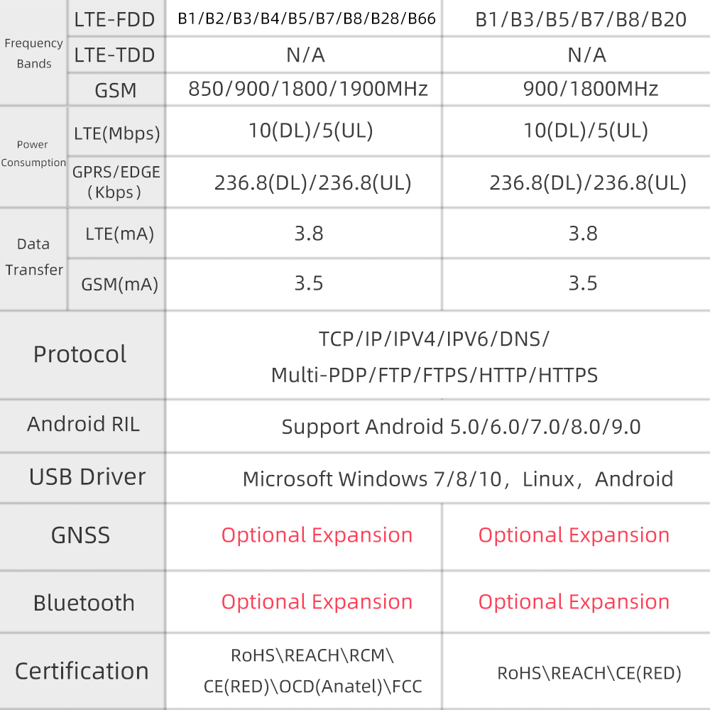

## 模块命名与兼容性说明
A7670G / A7670E / A7670SA 统称为 A7670X

A7672G 与 A7670G 完全相同，仅名称不同

A7608SA-H / A7608E-H / A7608E / A7608SA 统称为 A7608X
## 平台差异
SIM7670G 使用 高通（Qualcomm）平台

A7670X 使用 Asrmicro 平台

## 硬件版本与注意事项

### A7670 与 A7670 R2
使用方式完全相同

区别仅在于模块的芯片制造工艺不同

### A7608X-S3 V1.0 与 V1.1 差异
V1.1 增加了 太阳能输入电压分压电阻（占用 IO3）

其他部分保持不变

### T-A7608 与 T-A7608-V2 差异
移除：
* 模块复位引脚（IO5）
* 上电引脚（IO12）

增加：
* 板载 LED（IO12 控制）
* 太阳能电压检测功能（IO34，ADC）

## 功能限制说明

A7670E-LNXY-UBL 这个版本不支持语音和短信功能
## 规格比较

