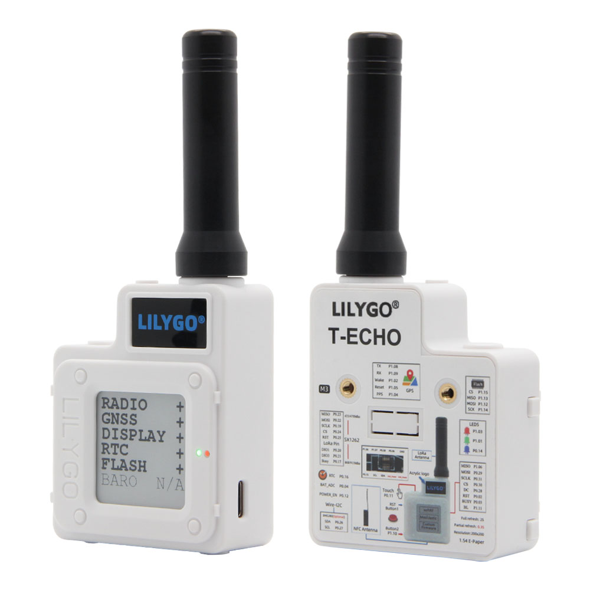
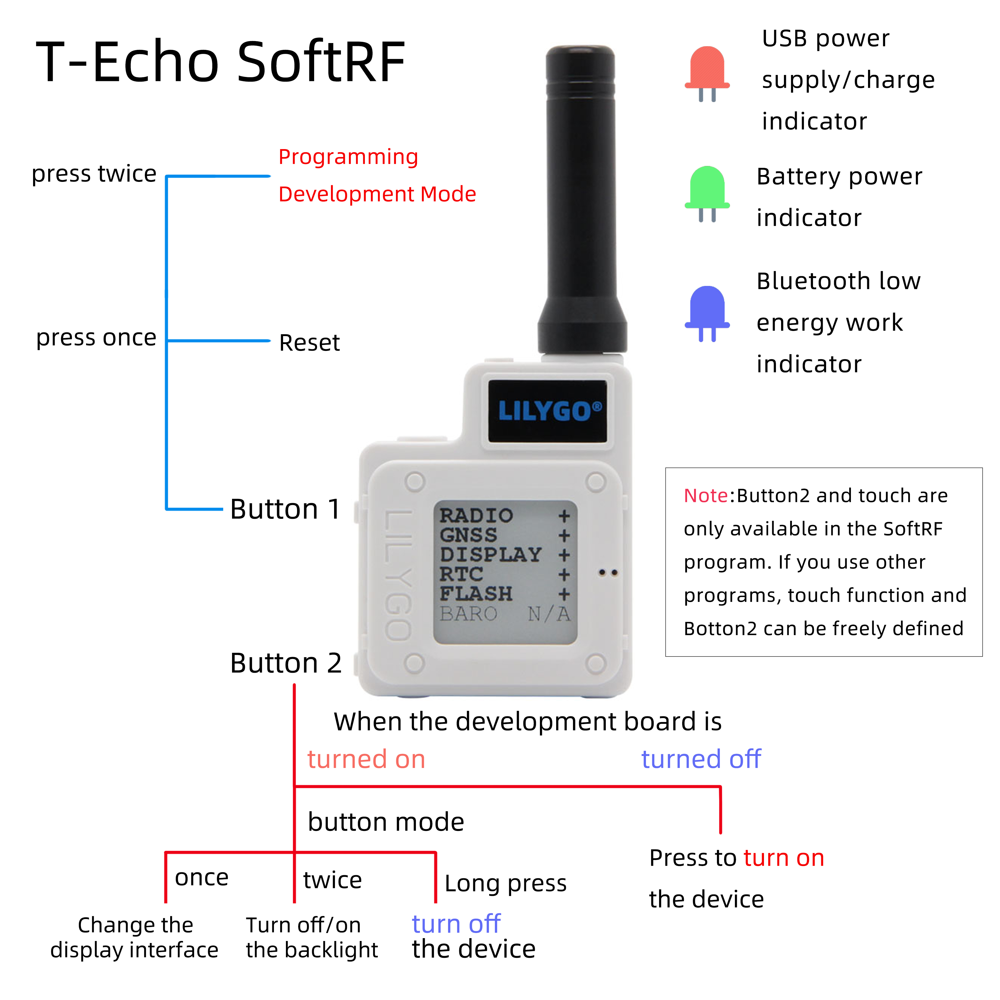
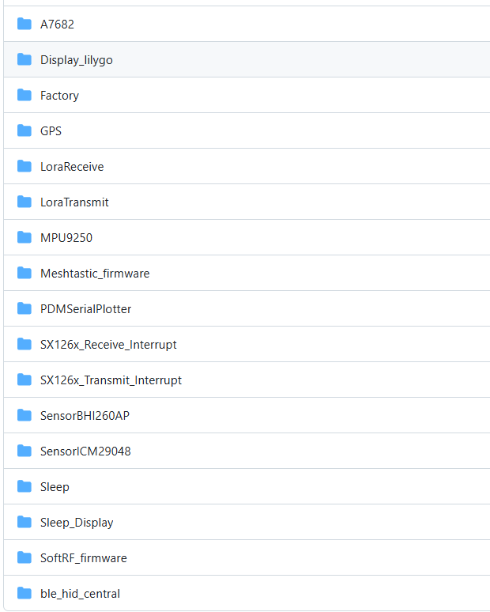

<div style="width:100%; display:flex;justify-content: center;">


</div>

<div style="padding: 1em 0 0 0; display: flex; justify-content: center">
    <a target="_blank" style="margin: 1em;color: white; font-size: 0.9em; border-radius: 0.3em; padding: 0.5em 2em; background-color:rgb(63, 201, 28)" href="https://lilygo.cc/products/t-echo-lilygo">速卖通购买</a>
</div>

## 版本迭代:
| Version | Update date | Update description |
| :-----: | :---------: | :---------------- |
| T-Echo_V1.0 | 最新版本 | 多功能LoRa通信设备初始版本 |

## 购买链接

| Product | MCU | LoRa | Screen | GPS | NFC | Link |
| :-----: | :--: | :---: | :---: | :--: | :--: | :--: |
| T-Echo | nRF52840 | SX1262 | E-Paper | 支持 | 支持 | [速卖通](https://lilygo.cc/products/t-echo-lilygo) |

## 目录
- [描述](#描述)
- [预览](#预览)
- [模块](#模块)
- [快速开始](#快速开始)
- [引脚总览](#引脚总览)
- [相关测试](#相关测试)
- [常见问题](#常见问题)
- [项目](#项目)
- [资料](#资料)
- [依赖库](#依赖库)

## 描述

T-Echo 是一款基于 nRF52840 芯片的多功能 LoRa 通信设备，集成了 E-Paper 屏幕、GPS 定位、NFC 功能和多种传感器。设备支持 Arduino 和 nRF5-SDK 开发环境，是开发 LoRa 通信、物联网节点和低功耗应用的理想平台。

T-Echo 兼容多个开源固件项目，包括 SoftRF 和 Meshtastic，可用于构建去中心化的通信网络。设备采用低功耗设计，支持多种省电模式，适合户外通信、环境监测等应用场景。

## 预览

### 实物图

<div style="width:100%; display:flex;justify-content: center;">



</div>

### 应用示例


- [T-Echo SoftRF](https://github.com/lyusupov/SoftRF/wiki/Badge-Edition)



- [T-Echo Meshtastic](https://github.com/meshtastic/Meshtastic-device/tree/v1.2.42.2759c8d)


## 模块


### MCU

* 芯片：nRF52840
* 架构：ARM Cortex-M4
* 无线：蓝牙 5.0
* FLASH：根据供货情况选择 MX25R1635FZUIL0 或 ZD25WQ16B

### LoRa

* 芯片：SX1262
* 频率：支持多频段
* 输出功率：-17 到 22 dBm

### 屏幕

* 类型：E-Paper
* 特性：低功耗显示

### GPS

* 功能：全球定位系统

### NFC

* 功能：近场通信

### 传感器

* 类型：板载多种传感器

### 概述

| 组件 | 描述 |
| :--: | :--: |
| MCU | nRF52840 |
| LoRa | SX1262 芯片 |
| 屏幕 | E-Paper 显示屏 |
| GPS | 支持定位功能 |
| NFC | 支持近场通信 |
| 开发环境 | Arduino, nRF5-SDK |
| 开源固件 | SoftRF, Meshtastic 兼容 |

## 快速开始

### 示例支持
进入[github](https://github.com/Xinyuan-LilyGO/T-Echo/tree/main/examples)仓库查看示例程序



### Arduino IDE 开发

1. 下载 [Arduino IDE](https://www.arduino.cc/en/software)
2. 打开首选项，添加 `https://www.adafruit.com/package_adafruit_index.json` 到板安装管理器地址列表
3. 打开板子安装管理器，等待索引更新完成，选择 'Adafruit nRF52 by Adafruit' 点击安装
4. 安装完成后，在板子列表中选择 'Nordic nRF52840 (PCA10056)'
5. 将 lib 目录中的所有文件夹拷贝到 Arduino 库文件夹中
6. 打开草图，选择正确的端口，然后点击上传

### PlatformIO 开发

1. 安装 [VS Code](https://code.visualstudio.com/) 和 [Python](https://www.python.org/)
2. 在 VS Code 扩展中搜索并安装 PlatformIO 插件
3. 重启 VS Code 后，左下角会出现 PlatformIO 图标
4. 点击文件 -> 打开文件夹 -> 选择 LilyGO-T-ECHO 文件夹
5. 点击左下角 √ 编译，→ 上传

> **注意**：使用 USB 下载固件时，需要双击复位按键进入 DFU 模式

### nRF5-SDK 开发

1. 下载 [nRF5-SDK](https://www.nordicsemi.com/Software-and-Tools/Software/nRF5-SDK/Download)
2. 使用 nRF5-SDK 进行编程，支持 NFC 等高级功能

### 开发平台
1. [Arduino IDE](https://www.arduino.cc/en/software) - 支持 Adafruit nRF52
2. [Platform IO](https://platformio.org/) - 跨平台开发
3. [nRF5-SDK](https://www.nordicsemi.com/Software-and-Tools/Software/nRF5-SDK/Download) - Nordic 官方 SDK

## 引脚总览

引脚定义请参考 [utilities.h](examples/Integration/utilities.h) 文件。

## 注意事项
1. 需要使用**lib**目录中的文件,它包括:
   - [`arduino-lmic`](https://github.com/mcci-catena/arduino-lmic)
   - `AceButton` 
   - `Adafruit_BME280_Library`   
   - `Adafruit_BusIO`        
   - `Adafruit_EPD`          
   - `AceButton` 
   - `Adafruit-GFX-Library`   
   - `Button2`        
   - `GxEPD`            
   - `PCF8563_Library `               
   - `RadioLib`     
   - `SerialFlash_ID539 `               
   - `SoftSPI`   
   - `TinyGPSPlus`   


2. 默认使用[Adafruit_nRF52_Arduino](https://github.com/adafruit/Adafruit_nRF52_Arduino),所有出厂已经烧录[Adafruit_nRF52_Bootloader](https://github.com/adafruit/Adafruit_nRF52_Bootloader),如果使用**nRF5-SDK**对板子编程 将会丢失原先Bootloader

3. 如果需要使用**nRF5-SDK**进行编程,请点击链接下载[**nRF5-SDK**](https://www.nordicsemi.com/Software-and-Tools/Software/nRF5-SDK/Download)

4. **Adafruit_nRF52_Arduino**中不支持**NFC**功能,请用[**nRF5-SDK**](https://www.nordicsemi.com/Software-and-Tools/Software/nRF5-SDK/Download)进行编程

5. FLASH将根据供货情况选择MX25R1635FZUIL0或者ZD25WQ16B。使用时注意区别。

6. 设置 LoRa 输出功率后需要配置电流限制：

```cpp
// 设置输出功率为 22 dBm（可接受范围 -17 到 22 dBm）
if (radio.setOutputPower(22) == RADIOLIB_ERR_INVALID_OUTPUT_POWER) {
    Serial.println(F("Selected output power is invalid for this module!"));
    while (true);
}

// 设置过流保护限制为 80 mA（可接受范围 45 - 240 mA）
// 注意：设置为 0 可禁用过流保护
if (radio.setCurrentLimit(80) == RADIOLIB_ERR_INVALID_CURRENT_LIMIT) {
    Serial.println(F("Selected current limit is invalid for this module!"));
    while (true);
}