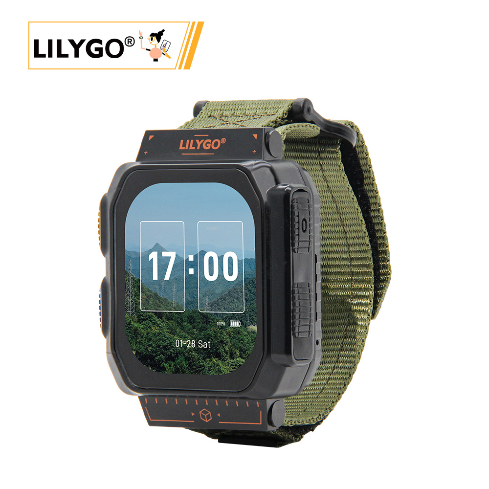
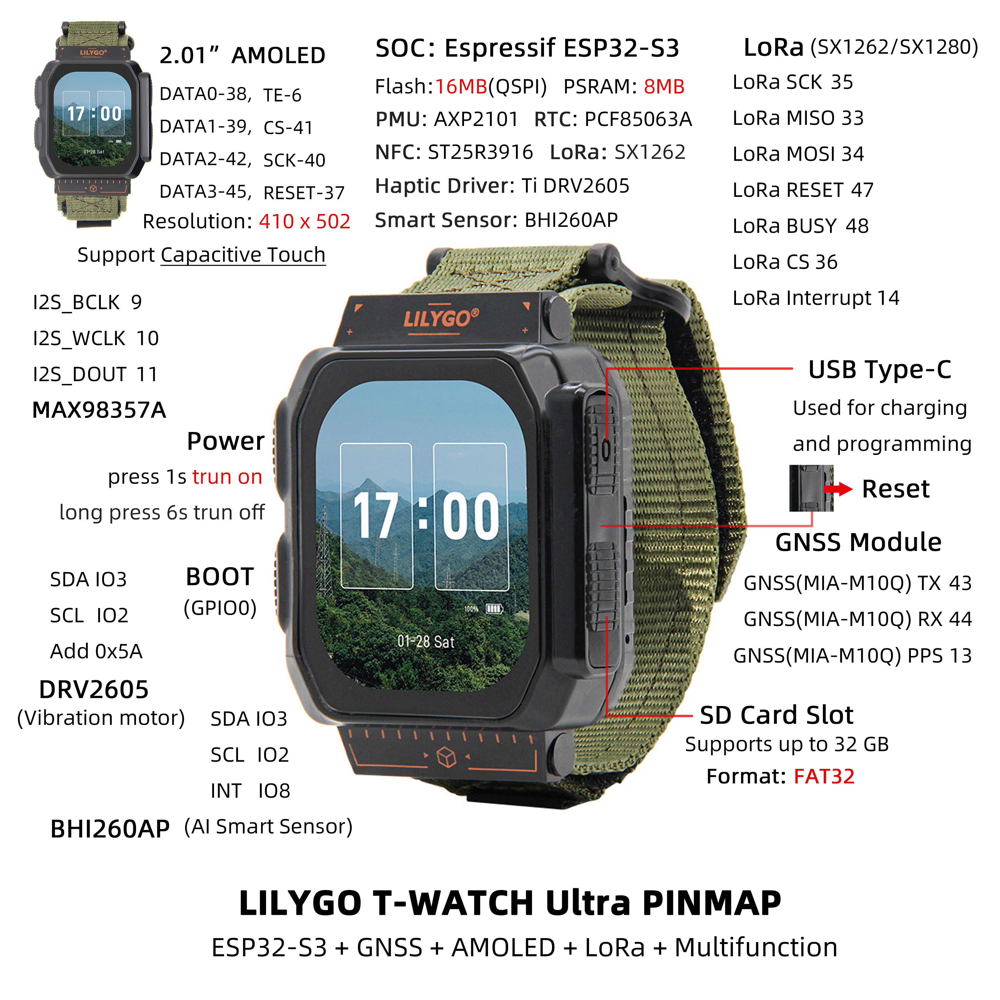

    <a target="_blank" style="margin: 1em;color: white; font-size: 0.9em; border-radius: 0.3em; padding: 0.5em 2em; background-color:rgb(63, 201, 28)" href="https://lilygo.cc/products/t-watch-ultra">官网购买</a>

## 版本迭代:
| Version | Update date | Update description |
| :-----: | :---------: | :---------------- |
| T-Watch-Ultra_V1.0 | 最新版本 | 高性能智能手表开发模组初始版本 |

## 购买链接

| Product | SOC | FLASH | PSRAM | Screen | LoRa | GNSS | Link |
| :-----: | :--: | :---: | :---: | :--: | :--: | :--: | :--: |
| T-Watch Ultra | ESP32-S3 | 16M | 8M | 2.06" AMOLED | SX1262/SX1280 | MIA-M10Q | [LILYGO Mall](https://lilygo.cc/products/t-watch-ultra) |

## 目录
- [描述](#描述)
- [预览](#预览)
- [模块](#模块)
- [快速开始](#快速开始)
- [引脚总览](#引脚总览)
- [相关测试](#相关测试)
- [常见问题](#常见问题)
- [项目](#项目)
- [资料](#资料)
- [依赖库](#依赖库)

## 描述

LILYGO T-Watch Ultra 是一款高性能智能手表开发模组，基于 ESP32-S3 双核处理器，搭载 16MB 闪存与 8MB PSRAM，支持 Arduino/ESP-IDF/MicroPython 开发环境。核心功能高度集成：

- **显示交互**：配备 2.06英寸 AMOLED 屏（410×502分辨率，1600万色），支持电容触控与 QSPI 高速渲染
- **四重无线通信**：集成 Wi-Fi/BLE 5.0、LoRa（SX1262/SX1280，覆盖433/868/915MHz频段）、GNSS定位（MIA-M10Q模块）及 NFC（ST25R3916）
- **智能感知与反馈**：内置 BHI260AP AI动作传感器、DRV2605触觉震动马达及 MAX98357A音频功放，实现运动识别与多模态交互
- **扩展与续航**：支持 MicroSD卡扩展（32GB FAT32），由 AXP2101电源管理芯片动态优化能耗，搭配 1100mAh电池（4.07Wh）
- **工业级设计**：紧凑尺寸（49×63.5×22mm），宽温域运行（-40℃~85℃），适用于户外运动设备、工业物联网网关等场景

## 预览

### 实物图

### 引脚图

## 模块

### MCU

* 芯片：ESP32-S3
* PSRAM：8MB (Octal SPI)
* FLASH：16MB
* 架构：双核 Xtensa LX7
* 无线：Wi-Fi 802.11 b/g/n + Bluetooth 5.0

### 屏幕

* 尺寸：2.06英寸 AMOLED
* 分辨率：410x502px
* 屏幕类型：AMOLED
* 色彩：1600万色
* 接口：QSPI

### LoRa

* 芯片：SX1262 / SX1280（可选）
* 频率：433-923MHz (SX1262) / 2.4GHz (SX1280)

### GNSS 定位

* 芯片：MIA-M10Q
* 特性：多星座 GNSS 接收器

### AI 传感器

* 芯片：BHI260AP
* 类型：AI 动作传感器
* 特性：支持复杂运动识别

### NFC

* 芯片：ST25R3916
* 功能：近场通信

### 音频

* 功放：MAX98357A
* 接口：I2S

### 电源管理

* 芯片：AXP2101
* 电池：1100mAh 锂电池
* 充电：USB Type-C 5V

### 扩展接口

* IO扩展：XL9555（16个扩展IO接口）
* 存储：MicroSD卡（最大32GB）

### 通话模块

* 芯片：T3902
* 功能：语音通话支持

### 概述

| 组件 | 描述 |
| :--: | :--: |
| MCU | ESP32-S3 双核处理器 |
| FLASH | 16MB |
| PSRAM | 8MB (Octal SPI) |
| 屏幕 | 2.06英寸 AMOLED (410×502) |
| 触摸 | CST9217 电容触摸屏 |
| LoRa | SX1262 (433-923MHz) / SX1280 (2.4GHz) |
| GNSS | MIA-M10Q 多星座定位 |
| NFC | ST25R3916 |
| AI传感器 | BHI260AP 动作传感器 |
| 音频 | MAX98357A 音频功放 |
| 振动马达 | DRV2605 触觉反馈 |
| 电源管理 | AXP2101 PMU |
| RTC | PCF85063A 实时时钟 |
| IO扩展 | XL9555 (16个IO) |
| 通话模块 | T3902 |
| 存储 | MicroSD卡扩展 |
| 电池 | 1100mAh 锂电池 |
| 无线 | Wi-Fi 802.11b/g/n + Bluetooth 5.0 |
| USB | 1 × USB OTG (Type-C接口) |
| 按键 | POWER + BOOT (内置) |
| 尺寸 | **63.5×49×22mm** (不带表带) |

## 快速开始

### 示例支持

| Example | PlatformIO/Arduino | ESP-IDF | Description |
| :------ | :----------------: | :-----: | :---------- |
| [Watch UI](https://github.com/Xinyuan-LilyGO/LilyGoLib) | ✓ | | 手表界面示例 |
| [GNSS Tracking](https://github.com/Xinyuan-LilyGO/LilyGoLib) | ✓ | | 卫星定位功能 |
| [LoRa Communication](https://github.com/Xinyuan-LilyGO/LilyGoLib) | ✓ | | LoRa 通信测试 |
| [AI Sensor](https://github.com/Xinyuan-LilyGO/LilyGoLib) | ✓ | | 动作识别示例 |
| [NFC Reader](https://github.com/Xinyuan-LilyGO/LilyGoLib) | ✓ | | NFC 功能演示 |

### Arduino
1. 安装[Arduino集成开发环境](https://www.arduino.cc/en/software)
2. 安装 [Arduino ESP32 版本 3.3.0-alpha1 或更高版本（最新版本）](https://docs.espressif.com/projects/arduino-esp32/en/latest/installing.html)
* 提示：Arduino 管理器网址：https://espressif.github.io/arduino-esp32/package_esp32_dev_index.json

3. [下载LilyGoLib库](https://github.com/Xinyuan-LilyGO/LilyGoLib/archive/refs/heads/master.zip)

4. Open `Arduino IDE` -> `Sketch` -> `Include Library` -> `Add .ZIP Library` -> `Select the library compressed package downloaded in step 3`

5. [安装 LilyGoLib-ThirdParty](https://github.com/Xinyuan-LilyGO/LilyGoLib-ThirdParty)
* 将 [LilyGoLib-ThirdParty](https://github.com/Xinyuan-LilyGO/LilyGoLib-ThirdParty) 中的所有目录复制到 ArduinoIDE 的库目录中，如果没有“libraries”目录，请创建它。
* 请注意，不要直接复制“LilyGoLib-ThirdParty”目录，而是将“LilyGoLib-ThirdParty”目录中的文件夹复制到库中。
* 如何在您的计算机上找到自己的库的位置，请[参考此处](https://support.arduino.cc/hc/en-us/articles/4415103213714-Find-sketches-libraries-board-cores-and-other-files-on-your-computer)
* Windows： `C:\Users\{用户名}\Documents\Arduino`
* macOS： `/Users/{用户名}/Documents/Arduino`
* Linux： `/home/{用户名}/Arduino`

>请注意，LilyGoLib-ThirdParty 中的库并非一定是最新版本。在确认硬件运行正常之前，请不要升级依赖库的版本。

每次打开 ArduinoIDE 时，它都会提示有新的库版本可供升级。
在尝试更新到最新版本之前，请先确认其运行正常。如果遇到问题，请回滚到正常运行的依赖库版本。当前依赖库版本的列表可查看 [此处](./third_party.md#t-watch-ultra-third-party)

6. “ `File` -> `Examples` -> `LilyGOLib` -> `helloworld`
7. `Tools` -> `Board` -> `esp32`,请从下面的表格中进行选择。
   | Arduino IDE Setting                  | Value                             |
   | ------------------------------------ | --------------------------------- |
   | Board                                | **LilyGo T-Watch-Ultra**          |
   | Port                                 | Your port                         |
   | USB CDC On Boot                      | Enabled                           |
   | CPU Frequency                        | 240MHZ(WiFi)                      |
   | Core Debug Level                     | None                              |
   | USB DFU On Boot                      | Disable                           |
   | Erase All Flash Before Sketch Upload | Disable                           |
   | Events Run On                        | Core 1                            |
   | JTAG Adapter                         | Disable                           |
   | Arduino Runs On                      | Core 1                            |
   | USB Firmware MSC On Boot             | Disable                           |
   | Partition Scheme                     | **16M Flash(3M APP/9.9MB FATFS)** |
   | Board Revision                       | **Radio-SX1262**                  |
   | Upload Mode                          | **UART0/Hardware CDC**            |
   | Upload Speed                         | 921600                            |
   | USB Mode                             | **CDC and JTAG**                  |

8. **板载版本选项**，请根据所购买的实际射频类型进行选择。目前的选项有：
* Radio-SX1262（1G 低频射频）
* Radio-SX1280（2.4G 低频射频）
* Radio-CC1101（1G（G）MSK、2（G）FSK、4（G）FSK、ASK、OOK）
* Radio-LR1121（1G + 2.4G 低频射频）
* Radio-SI4432（1G ISM）9. 选择“端口”10. 点击“上传”，等待编译和写入完成。11. 如果您无法上传草图或者 USB 设备一直出现在电脑上，请手动将该设备切换至下载模式。
>
> * 如果串口没有输出任何信息，请检查“USB CDC 在启动时启用”是否设置为“启用”。
> * 板本版本会根据实际的射频模块型号而变化。当前默认版本是 SX1262。
> * 该库依赖于最新的 [arduino-esp32](https://github.com/espressif/arduino-esp32/releases/tag/3.3.0-alpha1) 版本。如果低于 **V3.3.0-alpha1**，将会报错。

### T-Watch-S3-Ultra 进入下载模式
> 
> 🤖 USB 接口总是频繁地插拔吗？
> 如果您安装了第三方固件（例如 meshtastic），请务必按照以下步骤更新固件，无论它是 meshtastic 固件还是 lilygo 工厂固件。>
只有在程序不允许上传代码的情况下，才需要启用下载模式。在正常情况下，无需进行此步骤。>
按照以下步骤操作，即可将您的设备切换至下载模式。
> 1. 通过 USB-C 数据线将板子连接起来
> 2. 按下并持续按住 **BOOT** 按钮，在此期间同时按住**RST**按钮
> 3. 放开**RST**按钮
> 4. 松开 **BOOT** 按钮
> 5. USB 接口应已固定，不会再闪烁。您可以点击上传。
> 6. 按下**RST**按钮以退出下载模式>

如果新代码编写成功，但设备没有亮起或出现其他故障，请使用我们的工厂测试代码来测试外围设备是否能正常工作。请点击此处下载固件并进行测试编写。>

### 开发平台
1. [Arduino IDE](https://www.arduino.cc/en/software)
2. [Platform IO](https://platformio.org/)
3. [ESP-IDF](https://www.espressif.com/zh-hans/products/sdks/esp-idf)
4. [VS Code](https://code.visualstudio.com/)
5. [Micropython](https://micropython.org/)

## 引脚总览

| Name                                 | GPIO NUM                    | Free |
| ------------------------------------ | --------------------------- | ---- |
| SDA                                  | 3                           | ❌    |
| SCL                                  | 2                           | ❌    |
| SPI MOSI                             | 34                          | ❌    |
| SPI MISO                             | 33                          | ❌    |
| SPI SCK                              | 35                          | ❌    |
| SD CS                                | 21                          | ❌    |
| SD MOSI                              | Share with SPI bus          | ❌    |
| SD MISO                              | Share with SPI bus          | ❌    |
| SD SCK                               | Share with SPI bus          | ❌    |
| RTC(**PCF85063A**) SDA               | Share with I2C bus          | ❌    |
| RTC(**PCF85063A**) SCL               | Share with I2C bus          | ❌    |
| RTC(**PCF85063A**) Interrupt         | 1                           | ❌    |
| NFC(**ST25R3916**) CS                | 4                           | ❌    |
| NFC(**ST25R3916**) Interrupt         | 5                           | ❌    |
| NFC(**ST25R3916**) MOSI              | Share with SPI bus          | ❌    |
| NFC(**ST25R3916**) MISO              | Share with SPI bus          | ❌    |
| NFC(**ST25R3916**) SCK               | Share with SPI bus          | ❌    |
| Sensor(**BHI260**) Interrupt         | 8                           | ❌    |
| Sensor(**BHI260**) SDA               | Share with I2C bus          | ❌    |
| Sensor(**BHI260**) SCL               | Share with I2C bus          | ❌    |
| PCM Amplifier(**MAX98357A**) BCLK    | 9                           | ❌    |
| PCM Amplifier(**MAX98357A**) WCLK    | 10                          | ❌    |
| PCM Amplifier(**MAX98357A**) DOUT    | 11                          | ❌    |
| GNSS(**MIA-M10Q**) TX                | 43                          | ❌    |
| GNSS(**MIA-M10Q**) RX                | 44                          | ❌    |
| GNSS(**MIA-M10Q**) PPS               | 13                          | ❌    |
| LoRa(**SX1262 or SX1280**) SCK       | Share with SPI bus          | ❌    |
| LoRa(**SX1262 or SX1280**) MISO      | Share with SPI bus          | ❌    |
| LoRa(**SX1262 or SX1280**) MOSI      | Share with SPI bus          | ❌    |
| LoRa(**SX1262 or SX1280**) RESET     | 47                          | ❌    |
| LoRa(**SX1262 or SX1280**) BUSY      | 48                          | ❌    |
| LoRa(**SX1262 or SX1280**) CS        | 36                          | ❌    |
| LoRa(**SX1262 or SX1280**) Interrupt | 14                          | ❌    |
| Display CS                           | 41                          | ❌    |
| Display DATA0                        | 38                          | ❌    |
| Display DATA1                        | 39                          | ❌    |
| Display DATA2                        | 42                          | ❌    |
| Display DATA3                        | 45                          | ❌    |
| Display SCK                          | 40                          | ❌    |
| Display TE                           | 6                           | ❌    |
| Display RESET                        | 37                          | ❌    |
| Charger(**AXP2101**) SDA             | Share with I2C bus          | ❌    |
| Charger(**AXP2101**) SCL             | Share with I2C bus          | ❌    |
| Charger(**AXP2101**) Interrupt       | 7                           | ❌    |
| Haptic Driver(**DRV2605**) SDA       | Share with I2C bus          | ❌    |
| Haptic Driver(**DRV2605**) SCL       | Share with I2C bus          | ❌    |
| Expand(**XL9555**) SDA               | Share with I2C bus          | ❌    |
| Expand(**XL9555**) SCL               | Share with I2C bus          | ❌    |
| Expand(**XL9555**) GPIO6             | Haptic Driver Enable        | ❌    |
| Expand(**XL9555**) GPIO7             | Display Power supply enable | ❌    |
| Expand(**XL9555**) GPIO10            | Touchpad Reset              | ❌    |
| Expand(**XL9555**) GPIO12            | SD Insert Detect            | ❌    |

## 相关测试

| Mode        | Wake-Up Mode                                | Current |
| ----------- | ------------------------------------------- | ------- |
| Light-Sleep | PowerButton + BootButton + TouchPanel       | 4.6mA   |
| Light-Sleep | PowerButton + BootButton                    | 2.1mA   |
| DeepSleep   | PowerButton + BootButton (Backup power on)  | 1.1mA   |
| DeepSleep   | PowerButton + BootButton (Backup power off) | 840uA   |
| DeepSleep   | TouchPanel                                  | 3.34mA  |
| DeepSleep   | Timer (Backup power on)                     | 850uA   |
| DeepSleep   | Timer (Backup power off)                    | 1.1mA   |
| Power OFF   | Only keep the backup power                  | 77uA    |

## 常见问题

* **Q. T-Watch Ultra 相比其他版本有什么优势？**  
  A. Ultra 版本配备了更大的 AMOLED 屏幕、AI动作传感器、GNSS多星座定位、NFC功能，以及更大的电池容量，功能更加全面。

* **Q. 如何开机和关机？**  
  A. 按住 POWER 按键两秒开机，按住六秒关机。BOOT 按键为内置按键，用于程序烧录。

* **Q. 支持哪些 GNSS 星座？**  
  A. MIA-M10Q 模块支持 GPS、GLONASS、Galileo、北斗等多重卫星系统。

* **Q. AI 传感器有什么特殊功能？**  
  A. BHI260AP 可以识别复杂的动作模式，如手势识别、活动分类等，适合运动监测应用。

* **Q. 电池续航如何？**  
  A. 1100mAh 电池在正常使用下可提供数天续航，具体时间取决于功能使用情况。

## 项目

* [T-Watch Ultra 原理图](https://github.com/Xinyuan-LilyGO/LilyGoLib/tree/master/docs/hardware/)
* [示例代码](https://github.com/Xinyuan-LilyGO/LilyGoLib)

## 资料

* [原理图](https://github.com/Xinyuan-LilyGO/LilyGoLib/tree/master/docs/hardware/)
* [ESP32-S3 数据手册](https://www.espressif.com.cn/sites/default/files/documentation/esp32-s3_datasheet_en.pdf)
* [SX1262 数据手册](https://www.semtech.com/products/wireless-rf/lora-transceivers/sx1262)
* [MIA-M10Q GNSS 数据手册](https://www.u-blox.com/en/product/mia-m10-series)
* [BHI260AP 传感器数据手册](https://www.bosch-sensortec.com/products/motion-sensors/imu-with-integrated-ai/bhi260ap/)
* [AXP2101 电源管理](https://www.x-powers.com/en.php/Product/detail/id/145)

## 依赖库

* [TTGO_TWatch_Library](https://github.com/Xinyuan-LilyGO/TTGO_TWatch_Library/tree/t-watch-s3) - T-Watch系列开发库
* [LilyGoLib](https://github.com/Xinyuan-LilyGO/LilyGoLib) - LILYGO设备通用库
* [Arduino_GFX](https://github.com/moononournation/Arduino_GFX) - 图形显示库
* [LVGL](https://lvgl.io/) - 嵌入式图形库
* [RadioLib](https://github.com/jgromes/RadioLib) - LoRa通信库
* [TinyGPSPlus](https://github.com/mikalhart/TinyGPSPlus) - GPS解析库