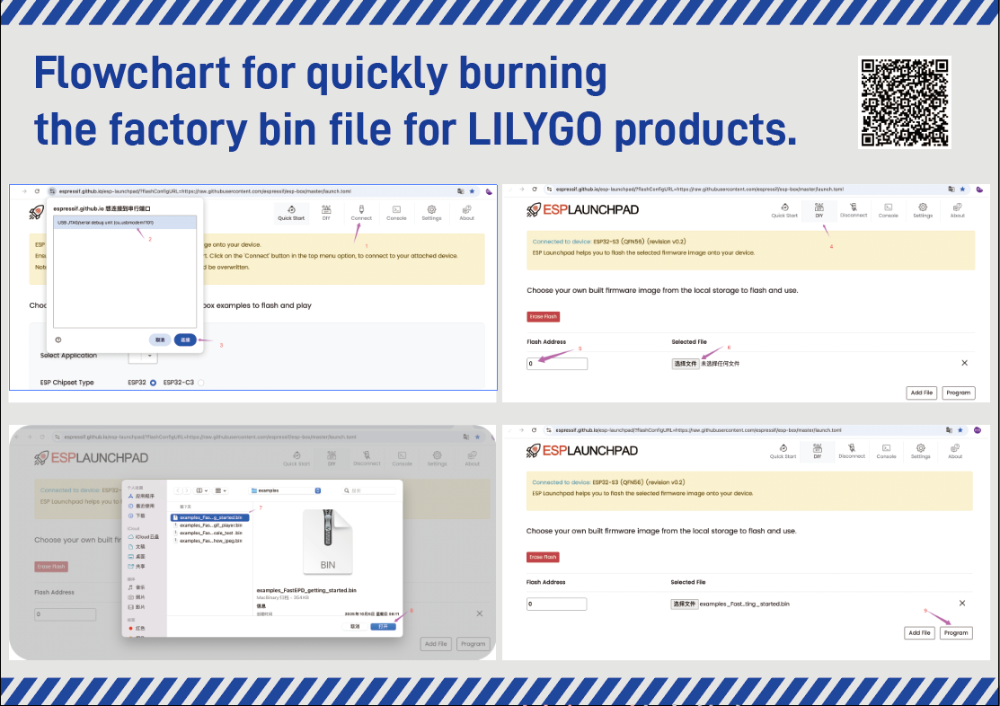
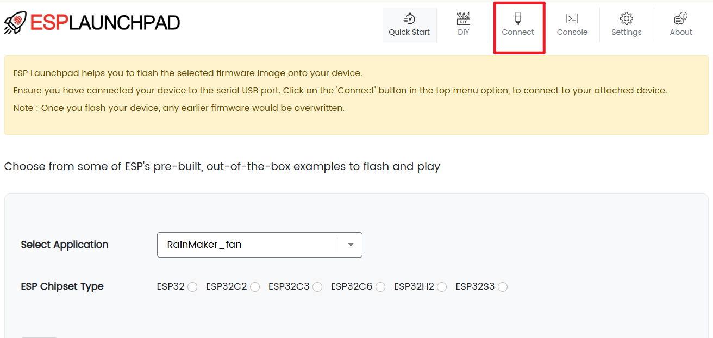
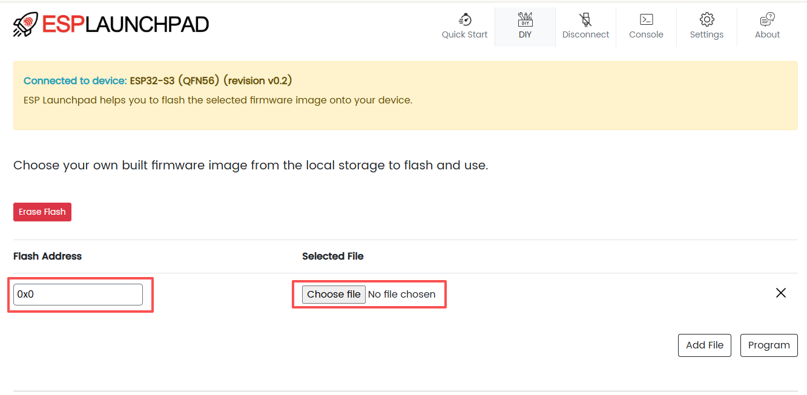
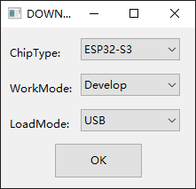
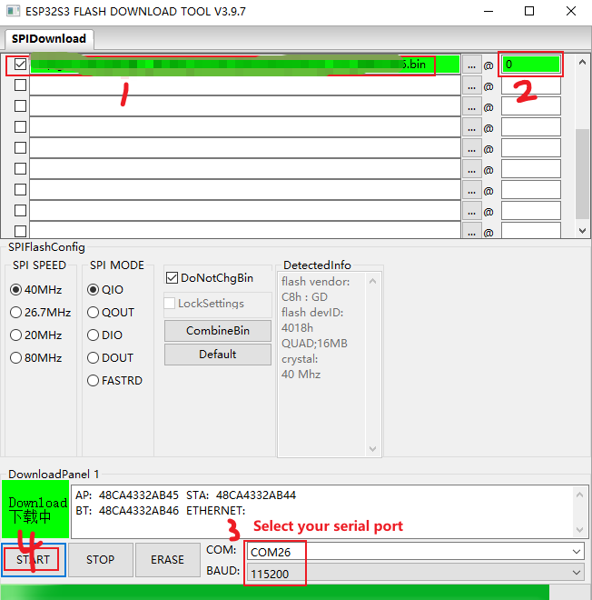

## Before downloding 

1. Please make sure that the device is connected to the computer via USB.
2. Please make sure that the device is in the download mode.
- `one` : BOOT key without releasing it

- `two` : Click the RST button 

- `three` : Finally, release the BOOT key

## Webpage download(Recommended)

### Download the firmware

Locate the [firmware](https://wiki.lilygo.cc/news/news/firmware.html) used by the device in the firmware file.

### Open the download tool web

 Open the download tool web: [Tool](https://espressif.github.io/esp-launchpad/)

### Download the firmware to the device.
- Click the "Connect" button on the tool to connect to the device.

### Select the firmware file to be downloaded.
- Flash Address set to 0x0
- Click the `Choose file` button to select the firmware file to be downloaded.

- Click the `Program` button to start the download.

## Flash download tool

### Video Guide

<iframe src="https://www.youtube.com/watch?v=f3BybP3L7ls" allowfullscreen width="100%" style="aspect-ratio:728/410;border:none " ></iframe>

### Download the firmware

- Download the `Flash Download Tools` , [Flash Download Tools](https://www.espressif.com/en/support/download/other-tools);

- Open the Flash Download Tools tool and select from the following figure

- Select the program you want to download and click Start key to download it as shown in the image below

## PlatformIO download

1. Install [VisualStudioCode](https://code.visualstudio.com/) and [Python](https://www.python.org/)
2. Search for the `PlatformIO` plugin in the `VisualStudio Code` extension and install it.
3. After the installation is complete, you need to restart `VisualStudio Code`
4. After restarting `VisualStudio Code`, select `File` in the upper left corner of `VisualStudio Code` -> `Open Folder` -> select the `"Your project"` directory
5. Click on the `platformio.ini` file, and in the `platformio` column, cancel the sample line that needs to be used, please make sure that only one line is valid
6. Click the (☑️) symbol in the lower left corner to compile
7. Connect the board to the computer USB
8. Click (➡️) to upload firmware
9. Click (🔌) to monitor serial output

## Arduino IDE download

1. Install the [Arduino IDE](https://www.arduino.cc/en/software)
2. Open the `Arduino IDE` and select `Tools` -> `Board` -> `Board Manager`
3. Search for `ESP32` and install the `ESP32` board
4. Select the `ESP32` board in the `Tools` -> `Board` -> `ESP32`
5. Select the COM port of the board in the `Tools` -> `Port`
6. Open the `Your project` example in the `File` -> `Examples` -> `Your project`
7. Compile and upload the code to the board

> You can refer to the `README.md` file in each repository.