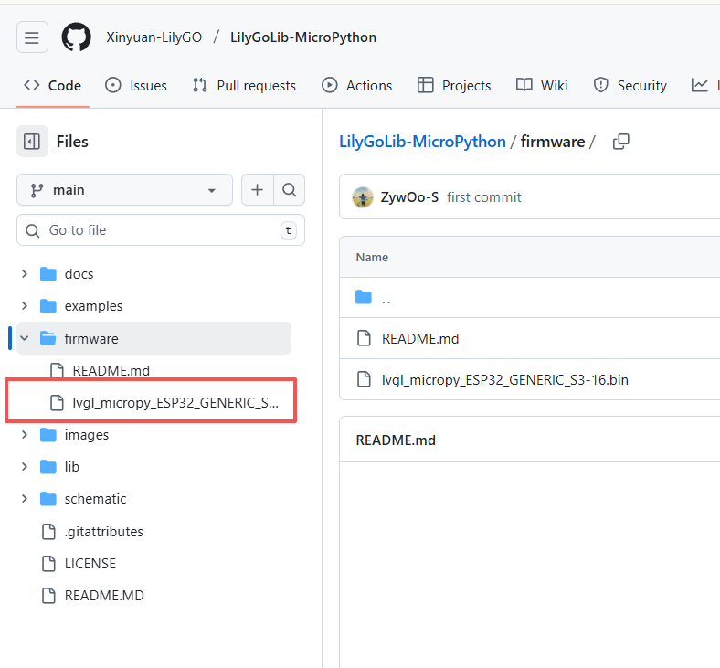

## How to use MicroPython on LILYGO devices

This article will guide you through the steps to use MicroPython on LILYGO devices.

### Install Micropython Firmware

- Find the code repository corresponding to the device in the LILYGO GitHub, and locate the corresponding firmware in the firmware folder.

| Product                 | Firmware Name             | Description
| ----------------------- | ----------------------------------------- |------------|
| T-LoRaPager       | [Firmware](./bin/Micropython/lvgl_micropy_ESP32_GENERIC_S3-16.bin)  |
| T-Display-S3      | [Firmware](./bin/Micropython/T-Display-S3.bin)        |

### Download MicroPython Firmware

Refer to the steps in the [Download](./download.md) document to download the MicroPython firmware.

### Connect the device to the computer

#### Arduino lab for micropython IDE
1. Install [Arduino lab for micropython IDE](https://labs.arduino.cc/en/labs/micropython).
2. Install **Desktop Version (Choose Linux or macOS or Windows)**

3. Open the folder and open "Arduino Lab for MicroPython.exe".

4. Connect the serial port.

5. Click Run the program (If you want to Stop the program, please click Stop).

6. If you want to run the program automatically, please click file and then create a new code named "main.py". Select  "Board" Then write the code into main.py and save it. Reset the T-LoRa-Pager.

#### Thonny IDE
1. Install [Thonny IDE]([Thonny, Python IDE for beginners](https://thonny.org/)) 

2. Download version 4.1.7 or the latest version (Choose Linux or macOS or Windows)

    

3. After installing the installation package, open Thonny IDE

4. Click Configure interpreter

    

5. Select MicroPython (ESP32)

    

6. Select the corresponding port number and confirm

    

7. Test run the program (Print "hello world" below is OK. You can use the shortcut key F5 to run the program and ctrl+F2 to end it)

    `print("hello world")`

    

8. If you want to run the program automatically, please click Save, then select MicroPython device and name it main.py

    

    

9. After successful saving, reset the LILYGO device
